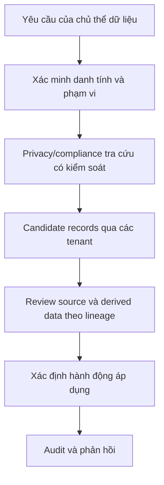
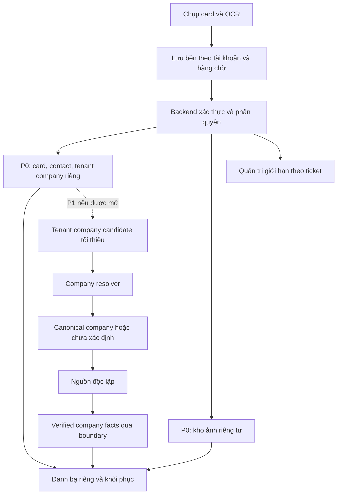
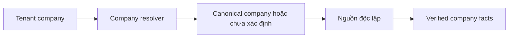

**BCard — Bản tư vấn phát triển ứng dụng “Danh bạ thứ 2” cho quan hệ kinh doanh**

**Bản 5.5 — freeze candidate: khóa contact methods, provenance lifecycle và dependency contract.**

Cập nhật ngày 08/09/2026. Baseline cho technical discovery, lấy báo giá và rà soát pháp lý/bảo mật; các ước tính chưa phải cam kết triển khai.

**Tên sản phẩm:** BCard.

**Mô hình sản phẩm mục tiêu:** mọi card được app tiếp nhận tại LOCAL_ACCEPTED theo mục 4 thuộc trách nhiệm lưu bền và đối soát theo mục 4; sync nội dung khi nghĩa vụ còn hiệu lực, lifecycle có thể supersede upload không cần thiết. Acceptance, sync từng object/version, lifecycle và incident được theo dõi riêng. Dữ kiện có cấu trúc ở database, ảnh ở kho riêng tư liên kết với bản ghi; mỗi tài khoản có danh bạ riêng. Đây là định hướng sản phẩm, chưa phải kết luận pháp lý/store cho full build hoặc dữ liệu thật.

P0 là release pilot độc lập, giữ card/contact/company riêng theo tài khoản và không có định danh công ty chung giữa các tenant. P1 chỉ mở sau gate pilot, có thể bổ sung research có nguồn và tính năng thương mại theo nhu cầu đã kiểm chứng. Voice note là experiment không được ảnh hưởng release; lọc ngành dùng nhãn, pilot có đối chứng.

Dùng bản 5.5 này cho technical discovery, legal opinion, báo giá P0, technical specification và prototype, sau đó mới quyết định ký full implementation P0.

**Trạng thái quyết định:** GO ngay cho discovery, báo giá, legal/store analysis và prototype bằng dữ liệu giả. Full P0 production implementation và pilot namecard thật là **Conditional GO** theo **Core P0 Legal & Store Gate** ở mục 9 và các blocking requirements của bước tương ứng. Bản này không ghi nhận gate đã đạt. **Cần ý kiến luật sư/store review strategy trước full implementation hoặc pilot dữ liệu thật.**

Các mốc thời gian, ngân sách, giá bán và chỉ tiêu là giả định lập kế hoạch, cần kiểm chứng bằng pilot và báo giá. Các phương án mở rộng là đề xuất; phần pháp lý cần được đối chiếu với thiết kế vận hành cụ thể.

**Cách đọc để chuyển sang specification:** [NORMATIVE P0] là requirement/boundary phải build/test hoặc điều kiện dự án phải đạt; [DISCOVERY DECISION] là implementation chưa chốt; [P1 / NON-P0] không estimate vào P0; [LEGAL REVIEW INPUT] là đầu vào rà pháp lý/store, không kết luận được phép; [PILOT HYPOTHESIS] là giả định cần thử, không phải yêu cầu kỹ thuật. Bảng có nhiều release theo nhãn từng hàng; nhãn hypothesis không nới hard gate.

---

## 1. Định vị sản phẩm: danh bạ thứ hai dành cho namecard

**[PILOT HYPOTHESIS]** Định vị/lợi thế cần kiểm chứng; **[NORMATIVE P0]** luồng và boundary P0 dưới đây được cụ thể hóa ở mục 4–5.

Sản phẩm giúp người thường đi networking có một nơi riêng để lưu, sắp xếp và tìm lại những người đã gặp trong công việc. Mỗi hồ sơ giữ ảnh namecard cùng thông tin liên hệ, doanh nghiệp, ghi chú và bối cảnh cuộc gặp.

Hai phần của hệ thống phục vụ cùng một trải nghiệm:

- **Ứng dụng Android/iOS — Release P0:** quét → lưu local → sync server → danh bạ → tìm kiếm cả khi offline → context/ghi chú → sử dụng thông tin liên hệ bằng basic actions → export dữ liệu tài khoản.
- **Server và trang quản trị:** tiếp nhận card theo lifecycle ở mục 4, lưu dữ liệu chính, đồng bộ tài khoản, quản lý chất lượng và vận hành theo quyền.

Ví dụ: A có 100 card đạt LOCAL_ACCEPTED, B có 50 thì app đã tiếp nhận 150 card; attach không làm giảm số snapshot. Số card version đã COMPLETE trên server được báo riêng. A thấy danh bạ A, B thấy danh bạ B. Số card không đồng nghĩa số người liên hệ duy nhất.

**P0 có basic contact actions:** mở màn hình gọi, mở email, mở website và sao chép thông tin theo thao tác người dùng, không cần quyền Contacts. Research, reminder, message template, tích hợp Zalo/WhatsApp và ghi sang danh bạ máy thuộc P1 hoặc sau pilot theo mục 5, không cộng vào báo giá P0.

Giá trị cốt lõi P0 cần kiểm chứng là tìm lại đúng người, giữ bối cảnh và sử dụng thông tin liên hệ. Search hoạt động trên dữ liệu đã có của tài khoản trên thiết bị, kể cả offline; mở trình gọi/email/browser không chứng minh cuộc gọi hay tin nhắn đã thực hiện. Mục 7 tách basic actions P0 khỏi phone Contacts export và tích hợp nhắn tin P1.

HubSpot đã có chức năng quét card tạo liên hệ CRM. Vì vậy, khác biệt đề xuất nằm ở trải nghiệm danh bạ kinh doanh, khả năng tìm lại và dữ liệu có nguồn; đây là giả thuyết sản phẩm cần thử nghiệm. [HubSpot Business Card Scanner](https://www.hubspot.com/products/business-card-scanner-app)

Hồ sơ do chính chủ chủ động cập nhật có thể là hướng phát triển sau. Khi có thay đổi công ty/chức danh, app nên đưa ra cập nhật để người dùng kiểm tra, giữ lịch sử và ghi chú riêng.

**Lợi thế cần chứng minh:** OCR là lợi thế tính năng; kho doanh nghiệp công khai chưa tự tạo lợi thế cạnh tranh bền vững. Lịch sử quan hệ và thói quen sử dụng có thể tăng giá trị giữ chân; entity resolution và phản hồi có quyền sử dụng có thể cải thiện dữ liệu. Chỉ gọi là hiệu ứng mạng khi thêm người dùng làm tăng giá trị cho người khác; chưa gọi là moat nếu lợi ích có thể bị tái tạo trong 6–12 tháng. Khả năng sao chép cũng cần kiểm chứng. Ưu tiên đo tìm đúng, dùng lại và trả tiền trước khi đầu tư event graph, mạng claim hay mạng cập nhật; không tạo chi phí chuyển đổi bằng cách chặn export.

---

## 2. Ba yêu cầu ban đầu sau khi điều chỉnh

**[P1 / NON-P0]** Bảng mô tả target product; riêng capture/OCR là **[NORMATIVE P0]**. Phạm vi hợp đồng P0 được chốt riêng ở mục 5 và 12, gồm basic contact actions nhẹ. Research, message workflow, tích hợp nhắn tin và phone Contacts export không là điều kiện nghiệm thu P0.

| Yêu cầu ban đầu | Đánh giá | Phạm vi nên triển khai |
|---|---|---|
| Chụp hai mặt, trích xuất thông tin | Khả thi | Ghép mặt trước/sau thành một hồ sơ; cho bỏ qua mặt trống; cảnh báo ảnh mờ, lóa; giữ ảnh card đủ rõ để đối chiếu theo chính sách ảnh ở mục 8. |
| Tìm hiểu và tóm tắt doanh nghiệp | Khả thi, chất lượng phụ thuộc nguồn | Xác định đúng doanh nghiệp/pháp nhân liên quan trước; đọc website chính thức và nguồn phù hợp; mọi dữ kiện có đường dẫn và ngày tra cứu. Là tính năng có hạn mức theo gói và lựa chọn sử dụng. |
| Gợi ý số điện thoại liên quan | Khả thi trong phạm vi doanh nghiệp | Hotline, văn phòng, sales, hỗ trợ do doanh nghiệp công bố. Tách bạch với số của người trao card. |
| Tự động lưu vào danh bạ máy | **Tùy chọn theo nhu cầu** | Xem mục 7. Mặc định giữ trong danh bạ riêng của app và đồng bộ server; người dùng chọn liên hệ cần lưu thêm sang điện thoại. |
| Tự kết bạn Zalo bằng tài khoản cá nhân | Chưa tìm thấy API công khai chính thức để cam kết | Mở link/QR chính chủ hoặc sao chép số để người dùng tự kết bạn trong Zalo. |
| Tự gửi invite WhatsApp cá nhân | Cần đổi mô tả tính năng | Mở trò chuyện với lời nhắn điền sẵn, người dùng bấm gửi. WhatsApp không có luồng kết bạn như Zalo. |

**Khuyến nghị mới: bỏ hẳn việc yêu cầu người dùng đăng nhập Zalo/WhatsApp.** Mục đích ban đầu của việc login là để app tự gửi lời mời kết bạn. Chưa có cơ sở để cam kết tự gửi lời mời bằng API công khai; P1 nếu được chọn có thể mở kênh nhắn tin mà không cần giữ phiên đăng nhập tài khoản cá nhân. Xin một quyền truy cập tài khoản cá nhân mà không có lợi ích tương ứng sẽ làm giảm niềm tin người dùng và có thể vướng nguyên tắc tối thiểu hóa dữ liệu khi Apple/Google review. Chỉ cần mở app ngoài bằng link/URL scheme công khai, không cần đăng nhập. Không bao giờ thu mật khẩu, OTP hay session của tài khoản nhắn tin cá nhân.

Zalo phân biệt đăng nhập Social và tích hợp Official Account; từ tài liệu công khai kiểm tra được, chưa có API chính thức cho phép app tự gửi lời mời kết bạn bằng tài khoản cá nhân, và đăng nhập Zalo không cấp quyền điều khiển tài khoản đó. [Zalo Developers](https://developers.zalo.me/) WhatsApp hỗ trợ click-to-chat bằng số quốc tế kèm nội dung điền sẵn. [WhatsApp click-to-chat](https://faq.whatsapp.com/5913398998672934) WhatsApp Business Platform là hướng riêng, cần người nhận đồng ý liên lạc và tuân thủ quy định template — không coi việc trao card là đồng ý nhận chiến dịch. [WhatsApp Business Messaging Policy](https://business.whatsapp.com/policy)

---

## 3. Dữ liệu tập trung trên server, phân quyền theo tài khoản

**Mọi card đã LOCAL_ACCEPTED và các thay đổi object đã lưu bền phải có trạng thái xử lý đối soát được theo mục 4.** Ảnh, snapshot/OCR, contact, quan hệ công ty, ghi chú và metadata theo sync của từng object/version; xóa/hạn chế và incident được ghi riêng, không biến thành sync success. Cho phép ghi rõ mặt sau trống. OCR trên điện thoại không thay đổi đích lưu trữ; khi offline giữ bền, sync khi nghĩa vụ còn hiệu lực hoặc xử lý lifecycle/derived data theo scope.

Bốn nhóm sau là cách tổ chức mục đích và quyền, không phải bốn database hay microservice. P0 tập trung danh bạ riêng; chưa xây sản phẩm thống kê ngoài hoặc mạng hồ sơ cá nhân chung.

### [NORMATIVE P0] Nhóm 1 — Danh bạ namecard theo tài khoản

Gồm card, ảnh, liên hệ, OCR, trường đã sửa, thông tin công ty từ card, ghi chú, tag, sự kiện và lời hẹn nếu có. Bản ghi gắn tài khoản, mã ổn định và phiên bản theo đối tượng. Database lưu dữ kiện; object storage riêng tư lưu ảnh và thumbnail; bản cục bộ phục vụ thao tác/offline.

**Source-of-truth P0:**

| Đối tượng | Nguồn sự thật nghiệp vụ |
|---|---|
| Card | Evidence/snapshot lịch sử của một lần scan: ảnh, raw OCR gốc, normalized values tại lần scan, correction gắn lần scan, ngày scan và provenance |
| Contact | Person current state: tên và thuộc tính hiện hành của người; không chứa một phone/email duy nhất, company/title hoặc company website như nguồn độc lập. Preferred pointers chỉ phục vụ hiển thị/thao tác |
| ContactMethod | Mỗi contact có 0..n phone/email cùng tồn tại; mỗi value có stable ID, type, label, status/lifecycle, provenance, confirmation metadata và version |
| Tenant company | Hồ sơ công ty hiện hành trong tenant, gồm company website/domain/general URLs; không copy mặc định sang Contact và không thay snapshot từng card |
| contact_company | Source-of-truth quan hệ người–công ty: 0, 1 hoặc nhiều quan hệ ACTIVE đồng thời; contact_id, tenant_company_id, title/role, relationship_status, provenance và version; effective dates chỉ khi biết |

Card ngày X có thể ghi “Sales Manager tại ABC”; hiện tại cùng người có thể là “Founder — ABC” và “Advisor — XYZ”, cả hai quan hệ ACTIVE. relationship_status (ACTIVE/FORMER/UNKNOWN hoặc tương đương) là trạng thái nghiệp vụ quan hệ, tách khỏi lifecycle ACTIVE/RESTRICTED/DELETED. Không ràng buộc chỉ một row current.

Nếu danh sách cần một dòng chính, dùng **primary_display_relationship_id** do user chọn hoặc rule hiển thị rõ. Đây là presentation pointer tới quan hệ được phép hiển thị, không sở hữu company/title và không giới hạn số quan hệ active. Đổi primary không sửa employment; pointer/cache sai, nguồn bị xóa/hạn chế phải được xử lý/rebuild từ contact_company theo policy hiển thị. Màn hình card vẫn đọc snapshot của lần scan, không thay bằng employment hiện tại.

**[NORMATIVE P0] ContactMethod cardinality và website ownership:** Contact có 0..n PHONE/EMAIL methods. Mỗi method có value, label (mobile/office/work/personal/other hoặc tương đương), status/lifecycle, provenance/confirmation và version. Nhiều methods có thể cùng ACTIVE; Contact không lưu thêm bản sao phone/email làm nguồn sự thật thứ hai.

preferred_phone_method_id và preferred_email_method_id nếu có chỉ là user-preference/presentation pointers. Chúng không làm method khác mất hiệu lực; pointer trỏ method DELETED/RESTRICTED/inactive phải clear hoặc rebuild theo policy, không copy value trở lại Contact.

Contact chỉ sở hữu personal website/portfolio hoặc URL thật sự gắn với người. TenantCompany sở hữu company website/domain/general URLs. Contact profile có thể hiển thị company URL qua contact_company active, nhưng không copy mặc định URL đó vào Contact. Basic action phải cho biết đang mở personal URL hay company URL qua relationship.

Scan đầu có thể tạo contact **nháp/chưa xác nhận** và 0..n ContactMethod để lưu nhanh/tìm offline; không bắt user duyệt trước LOCAL_ACCEPTED. Card mới gợi ý attach contact hiện có hoặc tạo mới. Khi attach, phương thức liên hệ khác biệt và quan hệ công ty trở thành UpdateProposal đúng target/value/relationship; không tự ghi đè. User từ chối thì current state giữ nguyên, card vẫn là snapshot riêng.

Correction lỗi OCR là chỉnh sửa có chủ đích gắn với lần scan, có version/provenance và phân biệt với raw OCR gốc; thay đổi công việc hiện tại không phải correction cho card cũ. “Historical snapshot” là ngữ nghĩa nghiệp vụ, không bắt buộc database append-only hoặc cấm sửa metadata kỹ thuật. Workflow sửa/xóa/hạn chế hợp lệ và retention vẫn áp dụng cho ảnh, OCR, snapshot, contact/quan hệ liên quan, index/cache và backup theo phạm vi; không giữ PII vô hạn chỉ để bảo toàn lịch sử.

**[NORMATIVE P0] Value-level lineage:** mỗi current value/relationship quan trọng phải truy được nguồn, đặc biệt name, từng phone/email, personal URL, title/role, company relationship và field thuộc phạm vi quyền dữ liệu. Tối thiểu thể hiện target_object/target_collection/target_value_id hoặc relationship ID, value/version, source_type/source_id/source_field/source version, confirmation metadata và last_updated_at hoặc equivalent. Không bắt lineage cho mọi metadata kỹ thuật.

Một contact có thể đồng thời giữ mobile X từ Card A và office Y từ Card B; Y không mặc định thay X. Technical spec phải trả lời được từng value đến từ đâu, còn ACTIVE không, preferred value nào được chọn và xóa source nào ảnh hưởng value nào.

Source có thể là CARD, USER_INPUT, VERIFIED_SOURCE hoặc SYSTEM_DERIVED; Card B khác Card A bằng source_id và mỗi target value có ID riêng. Đây là phân loại nguồn, không thêm chức năng research P0. Nhiều nguồn cho cùng value có thể lưu nhiều liên kết hoặc current source cùng evidence/reference đủ dùng. **copied_from_card khác user_confirmed**: user xác nhận là action bổ sung, không đổi nguồn card thành USER_INPUT độc lập hoặc xóa provenance. Dữ kiện user tự nhập độc lập phải được ghi đúng nguồn đó.

**[DISCOVERY DECISION]** Cách lưu field provenance là lựa chọn schema, không bắt bảng riêng/event sourcing. Phải tra được: từng phone/email/URL/title/relationship đến từ đâu, card nào đề xuất, ai/khi nào xác nhận, value nào đang active/preferred và source bị xóa/hạn chế ảnh hưởng target value nào. Lineage chỉ phục vụ consistency/provenance/quyền dữ liệu/audit trong scope, không là people graph.

Backend kiểm tra quyền ở đọc/tìm/sửa/xóa/export/tải ảnh. Người dùng A không truy cập được danh bạ B. P0 không cần biết công ty ABC của A có cùng công ty ABC của B hay không; không có canonical/shared company ID hoặc gộp người phục vụ sản phẩm giữa các tài khoản.

Đơn vị vận hành cấp administrative roles theo chức năng và nguyên tắc least privilege: support, operations, privacy/compliance, security và limited admin. Tư cách nhà sáng lập không mặc định cấp quyền quản trị hoặc xem PII; mỗi người chỉ truy cập khi được gán role cụ thể, có nhu cầu công việc, đúng phạm vi và có audit. Admin/support mặc định thấy PII đã che trong phạm vi được phép; masking không thay thế phân quyền. Xem chi tiết cần reason/ticket và thời hạn; view, export và bulk export là quyền riêng. Support không có ô tìm tùy ý toàn bộ danh bạ; break-glass nếu cần vẫn có audit và review theo mục 10.

### [NORMATIVE P0] Data Subject Rights Capability

P0 bắt buộc có **Data Subject Rights Capability**: tiếp nhận → xác minh → xác định phạm vi → tìm source/candidate và derived fields/relationships liên quan → review → hành động theo căn cứ → audit → phản hồi.

**[NORMATIVE P0] Source deletion/restriction phải đánh giá derived data.** Khi Card A bị xóa/hạn chế hoặc thuộc data-subject action, truy lineage tới current values, các quan hệ active và proposal phụ thuộc; không chỉ dọn row/ảnh rồi báo xong. Với mỗi phần liên quan, xác định giữ/sửa/hạn chế/xóa theo nguồn còn lại, confirmation và phạm vi áp dụng. Card B cùng chứng minh một value hoặc USER_INPUT độc lập là evidence cần xét, không tự động giữ hay xóa toàn contact.

**[LEGAL REVIEW INPUT]** Hiệu lực pháp lý của việc xóa/hạn chế source lên derived values phải được luật sư kết luận theo căn cứ/phạm vi. User confirm không tự tạo căn cứ giữ hoặc nguồn độc lập. Requirement kỹ thuật là đủ lineage/dependency và không bỏ sót derived data; rule cụ thể được đưa vào implementation/nghiệm thu sau kết luận, không tự viết luật trong schema.

**[NORMATIVE P0] Provenance lifecycle:** lineage metadata đủ chứng minh nguồn/consistency nhưng chỉ giữ PII tối thiểu. Provenance links, proposal current/proposed values, evidence text và audit payload cũng thuộc lifecycle/retention; không trở thành “shadow PII database”. Khi source/target bị DELETED/RESTRICTED, phải xác định reference ID/timestamp tối thiểu nào được giữ và value/evidence nào phải redact, pseudonymize, hạn chế hoặc xóa.

**[LEGAL REVIEW INPUT] [DISCOVERY DECISION]** Rule retention/redaction cụ thể theo căn cứ, scope và thiết kế vật lý; product spec không tự quyết định. **Data Map là deliverable bắt buộc của technical discovery** và phải bao phủ source card/images/raw OCR/snapshot; contacts/contact methods/contact_company/tenant company fields; proposals/provenance/preferred pointers; local/server index, display/thumbnail/export cache, queue, backup và audit metadata. Discovery deliverable ghi component, dữ liệu, source, nơi lưu, lifecycle, delete/restrict behavior, retention và bên được truy cập; không cần công cụ enterprise.

**Capability là P0 requirement; indexed locator là một implementation option được quyết định trong discovery theo volume, pháp lý và chi phí.** Pilot nhỏ có thể tra cứu thủ công/bán thủ công có kiểm soát bởi privacy/compliance role. Không bắt buộc subsystem, endpoint/index riêng hay kho identity toàn thị trường. **Quyết định trong technical discovery.**

Chỉ privacy/compliance role đã được cấp quyền cho vụ việc mới dùng sau xác minh danh tính người yêu cầu. Tra cứu có mục đích/phạm vi gắn request. Candidate được xem ở mức tối thiểu theo quyền vụ việc; mở dữ liệu đầy đủ tuân thủ ticket/scope/thời hạn. Phải review trước sửa/xóa/hạn chế/xuất hoặc phản hồi theo căn cứ áp dụng. Không tự coi kết quả khớp là cùng người.

Không expose tra cứu này cho user thường; không hiển thị “ai đang giữ card của bạn”; không tái sử dụng matching/index cho recommendation, networking graph hoặc analytics. Lưu audit truy cập và hành động. Kết quả phục vụ vụ việc có retention riêng, không tạo canonical person ID hay tập liên kết dùng lại cho sản phẩm.



Phương án manual/semi-manual vẫn phải có scope, kiểm soát truy cập, review và audit; không mặc định export toàn database ra bảng tính hay cấp support global search. Khi quy mô cần mới cân nhắc restricted indexed locator. Mục 9 chốt quy trình áp dụng; mục 10 chốt quyền và kiểm thử capability theo phương án được chọn.

### [P1 / NON-P0] Nhóm 2 — Dữ kiện doanh nghiệp có nguồn

**[NORMATIVE P0] P0 chỉ có tenant company riêng.** Nhóm dữ kiện doanh nghiệp dùng chung chưa tồn tại trong schema hoặc luồng thực thi P0. Không thêm shared ID dự phòng chỉ để đồng nhất công ty giữa các tài khoản.

**P1 mới thêm resolver và canonical company khi triển khai research.** Tenant company cung cấp candidate tối thiểu đã kiểm tra; resolver tìm đúng doanh nghiệp, rồi đối chiếu nguồn độc lập. Chỉ facts qua boundary, nguồn và điều kiện sử dụng mới dùng chung. Canonical ID xác định thực thể, không chứng minh mọi dữ kiện đúng. Không copy dữ kiện từ card riêng sang company facts chung.

Bảng là boundary kỹ thuật đề xuất, không phải danh mục pháp luật bảo đảm an toàn:

| Trường | Điều kiện dùng chung ở nhóm 2 | Trường hợp giữ riêng/chờ kiểm tra |
|---|---|---|
| Tên pháp nhân | Đúng tổ chức, xác minh nguồn độc lập | Chưa rõ đơn vị hoặc liên kết phản ánh cá nhân |
| MST doanh nghiệp | Mã của tổ chức đã xác minh | MST/số định danh cá nhân bị gắn nhầm |
| Website | Trang tổ chức, URL sạch | Trang cá nhân, URL/token định danh riêng |
| Domain | Domain tổ chức được đối chiếu | Domain cá nhân; WHOIS về người đăng ký |
| Trụ sở | Địa điểm tổ chức đã xác minh | Đồng thời phản ánh nơi ở cá nhân |
| Hotline công ty | Kênh chung do tổ chức công bố | Mobile riêng gắn nhãn hotline |
| sales@company.com | Hộp thư chức năng chung | Thực tế định danh một người |
| nguyen.van.a@company.com | Không tự đưa vào nhóm 2 | Email công việc gắn người cụ thể |
| Điện thoại giám đốc | Không tự đưa vào nhóm 2 | Số cá nhân, kể cả xuất hiện trên web |
| Hộ kinh doanh đứng tên cá nhân | Xét từng dữ kiện đã tách | Mặc định giữ riêng bản ghi hỗn hợp tên/chủ hộ/địa chỉ/số cá nhân |

Phân loại theo **giá trị + ngữ cảnh + nguồn + liên kết**, không chỉ tên cột. Trường chưa rõ giữ nhóm 1. Quan hệ tài khoản–người–công ty–sự kiện luôn theo quyền riêng; không công bố số người quét hoặc người đầu tiên tìm ra công ty. Public không đồng nghĩa được tái sử dụng tùy ý. Xem đánh giá pháp lý/store ở mục 9.

### Nhóm 3 — Số liệu vận hành nội bộ

**[NORMATIVE P0]** P0 chỉ đo lỗi, độ trễ, chi phí, số tác vụ và chất lượng tối thiểu có quyền truy cập; không đưa nội dung card/ghi chú vào analytics.

**[P1 / NON-P0] [LEGAL REVIEW INPUT]** Không coi ngưỡng k ≥20 là bảo đảm ẩn danh. P0 chưa xây differential privacy (DP) hay bán thống kê ngành/sự kiện. Nếu mở sản phẩm thống kê ngoài, phải xác định đơn vị bảo vệ, cohort tối thiểu, nhóm hóa thuộc tính, ẩn ô nhỏ và ô suy ngược, hạn chế truy vấn, chống đối chiếu các lần công bố, không drill-down tới người/card và có retention riêng. Chỉ đánh giá DP khi bài toán công bố cần nó. [NIST SP 800-188](https://nvlpubs.nist.gov/nistpubs/SpecialPublications/NIST.SP.800-188.pdf), [NIST SP 800-226](https://nvlpubs.nist.gov/nistpubs/SpecialPublications/NIST.SP.800-226.pdf)

### [P1 / NON-P0] Nhóm 4 — Hồ sơ cá nhân được chủ động chia sẻ

Hoãn khỏi MVP. Claim, xác minh danh tính và consent chia sẻ là các trạng thái riêng; consent mới không tự khắc phục thu thập trước đó thiếu căn cứ.

Trong một tài khoản, P0 chỉ gợi ý trùng để user chọn attach card/lần gặp vào contact đã có hoặc tạo contact mới; sửa liên kết nhầm không phải merge/undo toàn hồ sơ. Không bật phân tích/gộp người chéo tài khoản cho sản phẩm. Data Subject Rights Capability chỉ tìm candidate cho từng yêu cầu quyền đã xác minh, không hợp nhất hồ sơ người. Hồ sơ công khai, lời mời claim và cập nhật cho người khác phải được đánh giá theo mục đích riêng. Nếu triển khai, chính chủ chọn trường/phạm vi phát hành, người nhận duyệt; ghi chú và lịch sử gặp giữ riêng. Không tự gửi lời mời từ kho card.



---

## 4. Luồng quét, card acceptance và đồng bộ tại sự kiện

### [NORMATIVE P0] Bốn chiều trạng thái độc lập

Không dùng một cột card_status hoặc một state machine chung cho acceptance, sync, availability và incident. Đây là ngữ nghĩa bắt buộc; tên enum/số trạng thái và cách lưu vật lý là **[DISCOVERY DECISION]**, không buộc thêm service/bảng riêng.

| Chiều | Trả lời câu hỏi nào? | Giá trị/ngữ nghĩa |
|---|---|---|
| Acceptance | App đã chính thức tiếp nhận card chưa? | NOT_ACCEPTED → LOCAL_ACCEPTED. CAPTURE_STARTED chỉ là capture UI/telemetry, không buộc là lifecycle lưu lâu dài |
| Sync theo object/version | Phiên bản object này đã lên server tới đâu? | PENDING, UPLOADING, PARTIAL, SERVER_ACCEPTED, COMPLETE, RETRY_WAIT, BLOCKED; discovery có thể gộp trạng thái thừa nhưng phải phân biệt nhận record, đủ dữ liệu, retry và bị chặn |
| Lifecycle/availability theo object | Object còn dùng bình thường không? | ACTIVE, RESTRICTED, DELETED. RESTRICTED có thể review/gỡ, không mặc định là terminal hoặc đã xóa |
| Incident/processing outcome | Có sự cố hay xử lý bất thường nào? | NONE, UNRECOVERABLE_DATA_LOSS, SECURITY_BLOCK, PROCESSING_TERMINATED hoặc tương đương; reason/evidence/action/audit tách riêng, không tính ngang sync success hoặc xóa chủ động |

**LOCAL_ACCEPTED là acceptance point:** ảnh các mặt bắt buộc đã lưu bền, có account/card ID, snapshot/manifest/version, allowance hợp lệ và queue hoặc thông tin đủ để phục hồi queue. Từ commit này hệ thống chịu trách nhiệm xử lý tiếp. UI chỉ báo “đã lưu trên máy” sau commit; crash trước UI phản hồi vẫn phải phục hồi. OCR/user confirmation độc lập, không chặn acceptance. Hủy trước đó là capture chưa nhận; xóa sau đó không xóa dấu acceptance để coi như chưa nhận.

**Invariant xử lý:** mọi card đã LOCAL_ACCEPTED và mọi thay đổi object đã tiếp nhận bền phải có trạng thái xử lý có thể đối soát: lifecycle hiện tại; sync từng object/version; backlog; incident nếu có; reason/audit của xóa, hạn chế hoặc chấm dứt. Không bắt mọi chiều hội tụ về một terminal state, không dùng đóng xử lý để đổi mất dữ liệu thành thành công.

**Invariant quota:** card được LOCAL_ACCEPTED trong allowance hợp lệ không bị từ chối chỉ vì quota giảm/hết/đổi kỳ sau đó. Chặn trước acceptance mới; retry idempotent không tạo duplicate hoặc trừ lần hai. Vẫn kiểm auth, quyền và lifecycle. Device policy được chọn không được làm mất accepted, ghi đè dữ liệu mới hoặc lộ chéo account.

### [NORMATIVE P0] Sync theo object/version

Các object P0 gồm card, card_image, contact, tenant_company, contact_company, encounter, note và tag/link khi có. Mỗi object có stable ID ưu tiên tạo trước trên client, version, sync state, last server ACK/version và idempotency metadata khi cần. Sync state độc lập nhưng reference có dependency; queue/backend xử lý theo mục 8. Sửa contact, quan hệ công ty hoặc note không đổi version/sync result của card snapshot đã hoàn tất.

COMPLETE của card (có thể ghi là SYNC_COMPLETE trên UI/tài liệu) chỉ chứng minh snapshot, manifest và ảnh bắt buộc **đúng version card đó** đã đủ và được ACK. SERVER_ACCEPTED mới nhận record hợp lệ, chưa chứng minh đủ ảnh. Ảnh có version/sync riêng và được manifest tham chiếu chính xác; ACK sai object/version không cập nhật object khác. Không dùng card làm aggregate kỹ thuật của contact/note/encounter.

```text
Card snapshot v1        COMPLETE
Images trong manifest  COMPLETE
Contact v4             COMPLETE
Contact v5             PENDING
Note v2                PENDING
```

Ví dụ này có card hoàn tất và hai thay đổi chưa đồng bộ. UI được tổng hợp “Còn 2 thay đổi chưa đồng bộ”, nhưng aggregate UI không phải source-of-truth của backend. Đề xuất cập nhật chưa được user duyệt cũng không làm card đủ manifest mắc pending; khi user duyệt, object đích có thao tác/version riêng.

### [NORMATIVE P0] Xóa, hạn chế và sự cố

| Trường hợp | Cách ghi nhận và xử lý |
|---|---|
| User xóa card/account hoặc quyết định xóa pháp lý | Lifecycle trong scope = DELETED; reason/actor/time/request/audit riêng. Giữ bằng chứng sync theo retention, supersede content upload không cần thiết và tombstone; đánh giá derived data theo lineage. Không đổi COMPLETE lịch sử thành failure hoặc tính xóa là sync success |
| Hạn chế xử lý | Lifecycle = RESTRICTED; restriction_reason, scope, expiry/review và legal_request_id nếu áp dụng. Chặn thao tác thuộc scope; phần không được phép sync ở BLOCKED. Gỡ hạn chế cần quyết định/audit và đối soát quyền/version, không gọi “REMOVED” hoặc tự suy ra đã xóa |
| Full revoke/security block | Chặn thao tác cần quyền, bảo vệ pending; incident SECURITY_BLOCK khi là sự cố theo policy. Revoke không tự đồng nghĩa xóa; khi chấm dứt xử lý, ghi PROCESSING_TERMINATED với reason/action/audit và quyết định lifecycle riêng |
| Lỗi mạng/token hết hạn/stale write | RETRY_WAIT hoặc BLOCKED theo nguyên nhân; không tự coi là incident nghiêm trọng, data loss hay kết thúc lifecycle |
| Mất dữ liệu không thể phục hồi | Incident = UNRECOVERABLE_DATA_LOSS, ghi phạm vi/evidence/recoverability/action/audit; sync chưa hoàn tất không được đổi thành COMPLETE, lifecycle không tự thành user/legal deletion |

Backlog gồm thao tác object/version chưa hoàn tất và công việc thực thi xóa/hạn chế còn lại; mỗi mục có reason, owner, next action và mốc review/escalation. Có thể đóng một tác vụ không còn thực hiện được theo quyết định có audit, nhưng phải giữ lịch sử thất bại/incident; không chỉ đổi enum để làm đẹp backlog.

DELETED không tự chứng minh mọi bản sao đã xóa vật lý. Thực thi và đối soát data map tại mục 3: source, derived values, proposal, index/cache/thumbnail, queue và backup theo retention. Chỉ báo hoàn tất phạm vi đã kiểm chứng; tombstone/audit giữ tối thiểu, không giữ toàn PII cần xóa. ACK/queue/restore cũ không hồi sinh bản xóa hoặc vượt hạn chế.

**[NORMATIVE P0] Lifecycle action supersedes unnecessary pending content upload.**

| Trường hợp | Behavior bắt buộc |
|---|---|
| LOCAL_ACCEPTED offline → delete trước server nhận PII | Không upload ảnh/OCR/card/contact content chỉ để xóa; purge local payload theo policy. Nếu server chưa biết object và không có mục đích accounting/legal/security/consistency bắt buộc, mặc định không tạo server object/tombstone chỉ để ghi từng tồn tại. Chỉ gửi metadata tối thiểu khi có mục đích đã xác định |
| Server đã nhận một phần hoặc upload đang chạy | Ưu tiên delete/hạn chế trước phần payload không còn được phép/cần thiết; dừng phần còn thiếu, dọn phần đã nhận theo scope. Tombstone/quyền chặn request đến muộn; ACK mất không chứng minh server chưa nhận, phải đối soát |
| Source đã sinh current fields/relationship/proposal | Xét lineage và scope trước giữ/sửa/hạn chế/xóa; không tải derived PII chỉ để xóa. Dữ liệu có nguồn/căn cứ độc lập và nghĩa vụ sync còn hiệu lực được xử lý riêng |

**[DISCOVERY DECISION]** Chốt khi nào quota reconciliation, security, consistency, legal/audit thực sự cần minimal metadata; field nào được gửi, retention và purge. Không giữ “card existed” trên server chỉ vì kiến trúc muốn audit mọi event. Nếu không có mục đích bắt buộc, đối soát/purge local theo policy mà không tạo artifact server. Nếu server đã nhận một phần, gửi minimal delete command, purge phần đã nhận và không upload PII còn thiếu.

Trước khi kết luận local loss, đối soát server/backup vì ACK mất không chứng minh payload chưa tới server. Nếu còn ID/manifest, ghi phần còn/mất và thời điểm phát hiện. Nếu mất cả local và dấu acceptance trước khi server biết, chỉ ghi sự cố/phạm vi có bằng chứng hoặc user báo, nêu phần chưa xác định; không giả audit từng card hoặc cam kết phục hồi. UNRECOVERABLE_DATA_LOSS luôn là incident/error outcome, dù công việc xử lý sự cố đã đóng; giới hạn backup ở mục 8 không hợp thức hóa lỗi app làm mất pending.

### [NORMATIVE P0] Luồng thao tác

1. Đăng nhập, chọn sự kiện nếu cần; kiểm quyền theo device policy đã chọn và allowance trước acceptance.
2. Chụp mặt có nội dung/xác nhận mặt trống; commit bền ảnh, snapshot/manifest và dữ liệu phục hồi → LOCAL_ACCEPTED rồi mới báo lưu trên máy.
3. OCR/kiểm tra sau hoặc xác nhận ngay; contact nháp được gắn nhãn. Gợi ý attach hoặc tạo contact theo mục 5; field khác biệt thành proposal, không tự merge.
4. Queue đúng account/object/version/dependency; đối soát ACK từng object. Trước tiếp tục content upload, kiểm lifecycle/proposal/source có còn cho phép; xóa/hạn chế supersede phần không cần thiết theo scope, incident báo riêng.
5. Tìm local/offline, giữ context, dùng tel/mailto/browser/copy và export đúng nguồn hiện hành/lịch sử. Research, reminder/template và phone Contacts export vẫn ngoài P0.

### [NORMATIVE P0] Offline search

Search không cần server round-trip trên dữ liệu đã có và được phép xem của account trên máy. Ít nhất tìm theo tên, công ty, số điện thoại, email, tag, sự kiện và ghi chú; không cần semantic search.

Phạm vi gồm bản đã sync/tải về và dữ liệu local chưa sync. LOCAL_ACCEPTED không phải đợi OCR xong: tìm theo trường/metadata đã thực có, kể cả note/tag và contact nháp; hiển thị phần đang chờ trích xuất, không hứa tìm được tên/số chưa nhập hoặc nhận dạng. Kết quả phân biệt contact hiện tại và card lịch sử, không thay nguồn này bằng nguồn kia.

Khi offline, ghi “Kết quả từ dữ liệu trên thiết bị”; chưa tải đủ danh bạ phải nói rõ giới hạn, không biến kết quả rỗng thành khẳng định liên hệ không tồn tại trên server. Online có thể cập nhật dữ liệu/index hoặc bổ sung server search, nhưng search P0 không phụ thuộc mạng. Discovery chọn cache/index đủ cho P0/pilot, không yêu cầu toàn bộ server dataset luôn ở mọi máy. Search phải hoạt động sau restart offline, cách ly account và không tạo kết quả trùng khi reconnect.

### [PILOT HYPOTHESIS] Đo thời gian theo tác vụ

| Thước đo | Phạm vi |
|---|---|
| Capture | CAPTURE_STARTED → LOCAL_ACCEPTED; tính chụp lại và kiểm tra ảnh đủ đọc |
| OCR | Gửi xử lý → có trường dự kiến; có thể chồng lấp lúc chụp mặt sau |
| Xác nhận | Người dùng kiểm tra/sửa trường |
| Ghi chú | Nhập/sửa bối cảnh, kể cả ghi nhận bỏ qua |
| Tổng tương tác | Công thao tác/chờ bị chặn, không cộng trùng bước song song; tính cả dọn sau |
| Hoàn tất server | LOCAL_ACCEPTED → COMPLETE của card version được đo và commit → COMPLETE cho object thay đổi khác; báo nhận record riêng, tách chờ mạng/quyền; xóa/hạn chế/incident không tính như sync thành công |

**Dưới 10 giây là giả thuyết capture nhanh khi camera đã sẵn, không phải benchmark thị trường.** Đo cả khởi động nguội. Mức 30–60 giây có thể là giả thuyết cho luồng gồm kiểm tra/ghi chú; không áp chung mọi bối cảnh.

| Bối cảnh | Luồng nên thử |
|---|---|
| Hội chợ | Chụp nhanh, tự gắn sự kiện, kiểm tra sau; đo p50/p90, bỏ dở và ảnh lỗi |
| Networking dinner | Lưu giữa các cuộc trò chuyện hoặc sau buổi; đo mức gián đoạn và nhớ bối cảnh |
| Sales visit | Xác nhận và ghi cam kết sau cuộc gặp; đo chất lượng lời hẹn |
| Sau sự kiện | Chụp lần lượt nhiều card rồi kiểm tra; đo card hoàn tất/phút và lỗi ghép hai mặt |


---

## 5. Phạm vi MVP và thứ tự ưu tiên

**[NORMATIVE P0]** Hàng P0 là phạm vi bắt buộc; **[P1 / NON-P0]** không vào báo giá P0. Voice experiment là **[PILOT HYPOTHESIS]**, được bỏ và không chặn release.

**Release P0 — Pilot Product** giao độc lập để kiểm chứng danh bạ. **Release P1 — Commercial/Value Expansion** có gate, hợp đồng và nghiệm thu riêng sau pilot. P0 không phụ thuộc company research, canonical company, AI research/LLM, reminders, billing hay xuất sang danh bạ máy. OCR vẫn là thành phần lõi. Phạm vi này phục vụ discovery/báo giá; ký và chạy full implementation phải qua Core P0 Legal & Store Gate. Camera/OCR/queue/sync/security prototype bằng dữ liệu giả được làm trước.

| Nhóm | Ưu tiên | Phạm vi |
|---|---|---|
| Tìm lại và tổ chức | [NORMATIVE P0] | Offline trên dữ liệu đã có theo account: tên/công ty/số/email/tag/sự kiện/ghi chú; gồm local pending theo dữ kiện thực có; ngành thủ công |
| Quét và sửa | [NORMATIVE P0] | Hai mặt, ảnh đối chiếu, Việt/Anh, lưu nhanh/kiểm tra sau hoặc xác nhận ngay; QR decoding ngoài P0 |
| Danh bạ riêng | [NORMATIVE P0] | Contact có 0..n methods; website person/company tách nguồn; lineage từng value, nhiều ACTIVE relationships; proposal ADD/UPDATE/REMOVE đúng target; attach/draft cleanup giới hạn, không full merge |
| Basic contact actions | [NORMATIVE P0] | Tap phone → tel:/màn hình gọi; email → mailto:; website → browser; copy phone/email/text; không quyền Contacts hoặc tự ghi đã gọi/gửi |
| Tài khoản và quyền | [NORMATIVE P0] | Auth/phiên, cách ly mobile/server, xuất/xóa dữ liệu tài khoản; không phụ thuộc billing |
| Lưu server | [NORMATIVE P0] | Bốn chiều state, object/version/dependency sync; lifecycle ưu tiên trước content upload không cần thiết; lineage và derived index/cache theo scope; device A/B giữ như mục 8 |
| Quản trị và hỗ trợ | [NORMATIVE P0] | Upload/OCR lỗi, analytics pilot tối thiểu; PII che mặc định, reason/ticket, quyền có thời hạn, audit |
| Quyền chủ thể dữ liệu | [NORMATIVE P0] | Source + derived fields/relationships/index/cache theo lineage trong scope; review/hành động/audit/phản hồi, không bắt indexed locator hay query graph |
| Voice note | [PILOT HYPOTHESIS] | Chỉ thử nếu không ảnh hưởng lịch/nghiệm thu P0; đọc ghi chú, sửa chữ và nhập chữ dự phòng |
| Nghiên cứu doanh nghiệp | [P1 / NON-P0] | Resolver, canonical company, nguồn độc lập và facts đã kiểm tra; entitlement hồ sơ nâng cao, quota/cache theo mục 11 |
| Danh bạ điện thoại | [P1 / NON-P0] | Xuất chọn lọc một chiều, tránh ghi lặp |
| Chăm sóc quan hệ | [P1 / NON-P0] | Nhắc việc, lời nhắn bằng mẫu và luồng nhắn tin/integration được chọn; basic tel/mailto/browser/copy đã thuộc P0 |
| Thu phí | [P1 / NON-P0] | Mua/khôi phục/hủy/gia hạn/hoàn tiền, quyền gói và quota server |
| Phần chưa xây | [P1 / NON-P0] | AI cá nhân hóa, tìm ngữ nghĩa, quét nhiều card trong ảnh, đội nhóm, graph cá nhân, claim/update network, thống kê ngoài, advanced multi-device conflicts |

**QR — chọn Option B:** không tự phát hiện/giải mã QR hoặc parse vCard trong P0. Hoãn sau pilot/P1 trừ khi discovery chứng minh cần cho core capture/search và chốt thay đổi phạm vi/báo giá riêng trước đặt hàng. Với baseline này, vendor không tính QR decoding vào nghiệm thu P0; các ví dụ Zalo QR là hướng P1.

Màn hình mở đầu: **danh bạ namecard có tìm kiếm và lọc offline trên dữ liệu đã có**. Các màn hình khác gồm quét, kiểm tra/chưa xác nhận, hồ sơ kèm ảnh, công ty, sự kiện và tài khoản/đồng bộ/quyền riêng tư. Quản trị là giao diện riêng.

**Ngành không phụ thuộc AI:** dùng taxonomy ngắn, đa nhãn và “chưa phân loại”. Tách nhãn riêng của người dùng khỏi ngành công ty đã xác minh. Nguồn đăng ký, profile công ty hoặc AI có thể bổ sung sau; không tự ghi đè nhãn riêng. Đo mức sử dụng bộ lọc trước tăng độ chi tiết.

**Voice note thử nghiệm:** người dùng bấm đọc ghi chú, không ghi nền/toàn cuộc trò chuyện. Xin microphone đúng lúc, từ chối vẫn gõ được. Transcript được sửa rồi lưu về server; audio là đầu vào tạm có lịch xóa, chưa cung cấp kho ghi âm lâu dài. Thử tên riêng, giọng vùng miền, trộn Việt–Anh và tiếng ồn; đo tổng thời gian sau sửa, nội dung hữu ích và chi phí. Hỗ trợ vi-VN không bảo đảm chất lượng trên mọi máy/bối cảnh. [Google STT languages](https://docs.cloud.google.com/speech-to-text/docs/v1/speech-to-text-supported-languages?hl=en), [STT best practices](https://docs.cloud.google.com/speech-to-text/docs/best-practices?hl=en)

Nếu experiment làm chậm release thì bỏ khỏi P0; chỉ xem xét làm chức năng chính khi có dữ liệu cho thấy tốt hơn nhập chữ. Không xây STT riêng, nhận diện người nói hoặc trợ lý cuộc họp trong MVP.

Sau pilot chỉ mở những phần P1 có bằng chứng nhu cầu; danh bạ được dùng lại không tự chứng minh research hữu ích. Nhắc việc, template, phone export và billing đều là phạm vi tùy chọn của P1, không là điều kiện hoàn thành hợp đồng P0.

**[NORMATIVE P0] Duplicate suggestion / attach:** khi scan, hiển thị “Có vẻ đây là người đã tồn tại” với hai lựa chọn: “Liên kết với contact hiện có” hoặc “Tạo contact mới”. Chọn contact cũ thì card snapshot và encounter mới liên kết đúng contact; không merge field. Phone/email khác biệt thành proposal cho contact; company/title thành proposal cho contact_company. User duyệt riêng, không dựa duy nhất vào tổng đài hay trùng tên.

Attach nhầm phải sửa được liên kết card/encounter mà không mất snapshot; không undo toàn bộ hồ sơ. **Draft B → attach vào A:** chỉ auto-clean B sau kiểm tra không còn card link, encounter, note, contact method user-entered, manual field, mọi contact_company, proposal, external link hoặc pending operation/dữ liệu user quan trọng cần giữ. Nếu còn user work/dependency thì giữ riêng hoặc review đơn giản, không auto-delete. Auto-clean kiểm dependency tại version hiện tại, không chỉ nhìn row rỗng; nếu không chắc thì giữ draft hoặc đưa vào simple review. Cleanup kiểm version/dependency, supersede thao tác draft không còn cần và áp lifecycle/lineage mục 3–4; không dùng cleanup để merge dữ liệu.

**[P1 / NON-P0]** Full merge/undo hai contact đã tồn tại vẫn ngoài P0; không mở merge wizard, mark-duplicate/chọn contact chính hoặc identity engine.

### [NORMATIVE P0] UpdateProposal — semantic object

Proposal có operation_type = ADD/UPDATE/REMOVE hoặc equivalent; source_type/source_id/source_field; target_object_type/target_object_id và target_value_id/relationship ID khi áp dụng; current_value/target version, proposed_value; status, created_at, decided_at/decided_by và reason/audit tối thiểu. current_value ở proposal là ảnh đối chiếu, không phải source-of-truth hiện hành. **[DISCOVERY DECISION]** Lưu riêng hay embedded đều được, không nhồi tất cả vào contacts.update_state hoặc thêm approval workflow.

| Operation | Ý nghĩa |
|---|---|
| ADD | Thêm method/value/relationship mới; không thay value hoặc quan hệ khác đang hợp lệ |
| UPDATE | Thay đúng target_value_id/relationship đã xác định và tạo target version mới |
| REMOVE | Đánh dấu/xóa đúng target theo lifecycle/policy; không xóa cả collection hoặc contact |

| Status | Ý nghĩa |
|---|---|
| PENDING | Chờ user quyết định, chưa sửa target; nếu nguồn/quyền đang review thì chặn accept với reason |
| ACCEPTED | Tạo mutation/version đúng target và ghi confirmation; giữ lineage nguồn gốc, proposal accepted local không đồng nghĩa target đã sync |
| REJECTED | Target không đổi, snapshot nguồn vẫn theo lifecycle của nó; giữ decision/reason tối thiểu theo retention |
| SUPERSEDED | Đề xuất được thay thế hoặc không còn áp dụng; ghi lý do, không áp lại qua retry |

ADD office phone Y tạo ContactMethod mới và không thay mobile X; UPDATE X→Z và REMOVE email cũ nhắm đúng target_value_id. ADD Advisor — XYZ tạo contact_company mới, không mặc định thay Founder — ABC. Đây là các proposal tới target riêng. Thêm “Sales Director — XYZ” không tự chuyển “Sales Manager — ABC” thành FORMER; user phải xác nhận riêng thay đổi quan hệ nào, vì có thể đồng thời nhiều ACTIVE.

Accept kiểm target version, lifecycle/quyền và điều kiện sử dụng source; cập nhật target cùng provenance/confirmation nhất quán. Target đã đổi thì không ghi đè bằng current_value cũ: đối soát/review hoặc supersede proposal. Source bị delete/restrict trước quyết định phải áp rule mục 3, chặn accept khi chưa kết luận; nguồn không còn được dùng thì SUPERSEDED và xử lý payload theo scope. Có nguồn khác được phép thì điều chỉnh/thay proposal với lineage đúng, không giả USER_INPUT. Proposal/decision cũng thuộc data map khi xóa/hạn chế; không giữ PII hết căn cứ chỉ để audit.

---

## 6. Nghiên cứu doanh nghiệp và cá nhân hóa là hai luồng

**[P1 / NON-P0]** Toàn bộ module mở rộng dưới đây ngoài nghiệm thu P0; các cấm/boundary dữ liệu vẫn phải được giữ.

### Nghiên cứu doanh nghiệp — P1

P0 chỉ lưu tenant company; chưa chạy resolver hoặc tạo canonical company. Khi P1 research được chọn, luồng là:



Card chỉ cung cấp candidate tối thiểu. Với công ty đã có facts/cache, kiểm tra đúng đơn vị, độ mới, nguồn và quyền dùng lại trước phục vụ. Nếu chưa đủ thì tìm/xác minh nguồn độc lập, không copy nội dung card thành facts chung. Quota người dùng đo entitlement theo mục 11, tách khỏi số lần xử lý/model.

Resolver có thể đối chiếu domain, phần domain email tổ chức, MST tổ chức, tên và địa chỉ trong backend được cấp quyền. Không gửi email đầy đủ có tên, mobile, nguyên card/OCR, ghi chú, sự kiện hoặc ID người dùng ra search/model chỉ để tìm công ty. Hộ kinh doanh và ca chưa phân loại giữ riêng hoặc chờ kiểm tra.

Không tự gán kết quả đầu tiên khi chỉ có tên phổ biến/Gmail. Thiếu domain hoặc khó match phải được giữ trong mẫu đánh giá coverage. Hiển thị ứng viên hoặc “chưa xác định”; chốt precision/coverage trước pilot P1.

Lưu riêng thông tin **từ card**, **từ web** và **người dùng xác nhận**. Dữ kiện bổ sung có URL, đoạn bằng chứng, ngày tra cứu và trạng thái kiểm chứng. Nguồn phải thực sự hỗ trợ đúng câu và đúng công ty; khi mâu thuẫn hiển thị khác biệt. Điểm model tự báo không phải xác suất đúng đã đo.

Giới hạn khởi đầu để benchmark: tối đa 3 truy vấn/5 trang mỗi lượt cơ bản, có thời gian, ngân sách và retry hữu hạn. Dùng lại cache vẫn có chi phí truy vấn, phục vụ và làm mới.

Website là dữ liệu tham khảo, không phải chỉ thị cho agent. Chặn URL tới mạng nội bộ và kiểm tra chuyển hướng; không để trang web đổi quyền, kích hoạt gửi tin hoặc lấy dữ liệu riêng. Chỉ dùng nguồn theo điều kiện phù hợp.

### Cá nhân hóa và màn hình tổng hợp

| Thành phần | Đầu vào | Xử lý/đầu ra |
|---|---|---|
| Company research model | Dữ kiện tổ chức và đoạn nguồn đã lọc | Tóm tắt sản phẩm/dịch vụ/khách hàng, có nguồn; hotline chức năng đã xác minh |
| Màn hình hồ sơ | Card riêng + kết quả công ty theo quyền | Hiển thị tên/chức danh, ảnh, nguồn, bối cảnh và phần chưa xác minh |
| Template khi mở module lời nhắn P1 | Tên, sự kiện, lời hẹn và mục tiêu người dùng chọn | Ghép xác định trên máy thành bản nháp; không personalized LLM và không là dependency P0 |
| Cá nhân hóa nâng cao | Phần riêng tối thiểu cần cho tác vụ | Chỉ đánh giá on-device/private cloud/nhà cung cấp riêng khi pilot chứng minh nhu cầu |

Không gửi nguyên HTML rồi tuyên bố model chỉ nhận dữ kiện công ty: đoạn nguồn có thể chứa tên lãnh đạo/email/mobile và cũng phải lọc. Hồ sơ/mục tiêu networking của người dùng app là dữ liệu riêng như ghi chú về người trên card.

Ví dụ template khi có module lời nhắn: “Chào anh/chị {tên}, tôi là {tên người dùng}, mình gặp tại {sự kiện}. Tôi gửi {tài liệu đã hẹn}. Mong trao đổi thêm về {chủ đề đã chọn}.” Người dùng xem và sửa trước khi mở kênh gửi. Quyết định dùng template/on-device composition được giữ; thời điểm triển khai thuộc P1.

Không ghi gợi ý do template tạo thành “AI đã research”; không bịa cam kết, khách hàng, doanh thu hoặc lời hẹn. Gợi ý hợp tác suy ra từ thông tin phải có nhãn và căn cứ; chưa làm model cá nhân hóa trong MVP. Xử lý trên máy không thay đổi nghĩa vụ đồng bộ nội dung người dùng đã lưu.

---

## 7. Sử dụng thông tin liên hệ P0 và danh bạ máy P1

### [NORMATIVE P0] Basic contact actions

Từ hồ sơ contact, sử dụng current state đang hiển thị và giá trị user chọn:

- Tap số điện thoại → mở `tel:`/giao diện gọi của OS; Android dùng `ACTION_DIAL`, không gọi trực tiếp bằng `ACTION_CALL`.
- Tap email → mở `mailto:` với địa chỉ được chọn; không thêm message template P0.
- Tap website → hiển thị nguồn rồi mở đúng personal URL của Contact hoặc company URL của TenantCompany qua relationship được chọn; không copy company URL vào Contact.
- Copy phone/email/text theo thao tác người dùng.

Đây là các cơ chế mở ứng dụng xử lý của OS; Android phân biệt mở dialer với gọi trực tiếp. [Android Common intents](https://developer.android.com/guide/components/intents-common), [Apple Phone Links](https://developer.apple.com/library/archive/featuredarticles/iPhoneURLScheme_Reference/PhoneLinks/PhoneLinks.html), [Apple Mail Links](https://developer.apple.com/library/archive/featuredarticles/iPhoneURLScheme_Reference/MailLinks/MailLinks.html)

P0 không cần quyền Contacts, không tự gọi/gửi và không suy ra “đã gọi”, “đã gửi” hay “đã kết nối” từ việc mở handler/copy. Thiếu ứng dụng xử lý phải thông báo và có lựa chọn copy, không crash. Gọi/gửi/tải website còn phụ thuộc ứng dụng ngoài và kết nối; offline search/copy không hứa hoàn tất các thao tác bên ngoài.

Nếu user chủ động dùng/copy thông tin từ card lịch sử, hiển thị nguồn/ngày scan; không tự lấy OCR cũ thay ContactMethod hiện hành. Với nhiều phone/email, UI dùng method user chọn hoặc preferred pointer hợp lệ và vẫn cho chọn method khác. Không thêm login Zalo/WhatsApp, automation, reminder hoặc CRM workflow vào P0.

### [P1 / NON-P0] Ghi sang danh bạ máy và tích hợp nhắn tin

Phần dưới là phương án **P1**, không thuộc nghiệm thu P0. Export dữ liệu tài khoản P0 khác ghi contact sang danh bạ máy. Person lấy current state/trạng thái xác nhận; company/title lấy các contact_company được phép hiển thị và tenant_companies. Nếu định dạng cần một dòng, có thể dùng primary_display_relationship_id theo rule công bố, không ngầm làm mất các quan hệ ACTIVE khác; export dữ liệu tài khoản phải giữ được danh sách quan hệ thuộc phạm vi chọn. Card lịch sử xuất snapshot riêng, không chọn ngẫu nhiên OCR cũ. Cách chọn/hiển thị primary và định dạng export là **[DISCOVERY DECISION]**, không mở rộng module Contacts P1.

**Mặc định: lưu vào danh bạ riêng và đồng bộ server.** Người dùng đẩy sang danh bạ máy theo từng liên hệ, cho những người họ thực sự cần gọi trực tiếp. Có thể bổ sung nút "đẩy tất cả người trong sự kiện này" cho ai muốn. Tùy chọn tự động đẩy toàn bộ vẫn có thể tồn tại nhưng phải do người dùng chủ động bật, kèm giải thích hệ quả.

Android có thể ghi trực tiếp khi được cấp quyền phù hợp. [Contacts Provider](https://developer.android.com/identity/providers/contacts-provider) Phương án mở màn hình thêm liên hệ của hệ thống bằng intent giúp giảm số quyền app phải xin. [Android Contacts intents](https://developer.android.com/identity/providers/contacts-provider/modify-data) iOS hỗ trợ tạo/sửa liên hệ khi được cấp quyền; từ iOS 18 có chế độ chỉ chia sẻ một phần danh bạ, nghĩa là app không thể hứa kiểm tra trùng toàn bộ nếu chỉ nhìn thấy một phần. [Apple Contacts access](https://developer.apple.com/videos/play/wwdc2024/10121/)

Quy tắc kỹ thuật: đối chiếu theo tên, email, số và bối cảnh; không tự gộp hai người chỉ vì cùng tổng đài hay cùng công ty. Lưu liên kết giữa hồ sơ trong app và liên hệ trên từng thiết bị, để thao tác thử lại không tạo bản sao. Khi triển khai P1, mặc định xuất một chiều. Ghi chú riêng về cuộc gặp giữ trong app, không đẩy sang tài khoản danh bạ đang được đồng bộ của thiết bị. Số điện thoại công ty tìm thêm từ web nằm riêng, người dùng chọn trước khi đưa vào danh bạ.

Với Zalo: ưu tiên QR/link trên card, có phương án sao chép số kèm hướng dẫn. **Lưu danh bạ không có nghĩa là đã kết bạn.** [Hướng dẫn danh bạ Zalo](https://help.zalo.me/huong-dan/chuyen-muc/ban-be-va-danh-ba/quan-ly-danh-ba-tren-zalo/) Chỉ ghi trạng thái "đã mở Zalo/WhatsApp" khi thực sự chuyển ứng dụng; trạng thái "đã liên hệ" hoặc "đã kết nối" do người dùng tự xác nhận, vì không có bằng chứng chính thức nào để app tự biết.

---

## 8. Kiến trúc kỹ thuật

**[DISCOVERY DECISION]** Đề xuất Flutter cho Android và iOS nếu lập đội mới; chọn theo năng lực đội sau khi thử camera, OCR, offline và secure storage. Kiểm tra Contacts khi chọn module phone export P1, không làm dependency P0. Flutter hỗ trợ tích hợp native; build iOS cần macOS. [Flutter platform integration](https://docs.flutter.dev/platform-integration)

**[NORMATIVE P0]** Bảng phân trách nhiệm, không bắt mỗi hàng một service; hàng P1 là **[P1 / NON-P0]**. Công nghệ cụ thể do discovery chốt.

| Thành phần | Vai trò theo release |
|---|---|
| Mobile | P0: camera/OCR, kiểm tra, danh bạ/offline search, local DB/index và queue theo account; basic tel/mailto/browser/copy; phone Contacts export và tích hợp nhắn tin thuộc P1 nếu chọn |
| Backend API | Xác thực, phân quyền, tiếp nhận bản ghi, cấp quyền upload/tải ảnh, tìm kiếm, đồng bộ phiên bản, xuất/xóa |
| Database | PostgreSQL hoặc lựa chọn tương đương; card snapshot/OCR/provenance, contact và tenant company hiện hành; version theo đối tượng |
| Kho ảnh | Object storage riêng tư; ảnh hai mặt đủ đọc chữ, thumbnail, mã ảnh liên kết với database |
| Worker | P0: queue/upload/sync/retry theo tài khoản; P1 mới có research worker |
| AI/tìm kiếm bên ngoài — P1 | Không là dependency P0; nguồn/đầu ra có cấu trúc, API key ở server và chi phí giới hạn |
| Quản trị — P0 | Role theo chức năng/least privilege, không mặc định cấp cho founder; masked theo scope, ticket/thời hạn; view/export/bulk export riêng; audit |
| Data Subject Rights Capability — P0 | Quy trình/công cụ có kiểm soát theo request xác minh, privacy/compliance và audit; manual/semi-manual phù hợp pilot, không bắt buộc endpoint/index riêng |
| Vận hành | Giám sát, backup, kiểm tra phục hồi, giới hạn tài nguyên, xử lý sự cố |
| Thanh toán — P1 nếu được chọn | StoreKit/Google Play Billing, xác minh server và quyền gói; không thuộc nghiệm thu P0 |

OCR trên máy giúp làm việc khi mất mạng và phản hồi nhanh. Ảnh và thông tin được đưa về server khi nghĩa vụ content sync còn hiệu lực; không upload phần đã bị lifecycle action supersede; xử lý cục bộ đồng thời giảm nhu cầu gửi dữ liệu sang nhà cung cấp OCR bên ngoài. ML Kit hỗ trợ xử lý trên thiết bị và có tiếng Việt trong Text Recognition v2; chất lượng đọc trường phải được benchmark trên card thực tế. [ML Kit](https://developers.google.com/ml-kit), [ngôn ngữ OCR](https://developers.google.com/ml-kit/vision/text-recognition/v2/languages)

### [NORMATIVE P0] Schema — dữ liệu riêng theo tài khoản

| Bảng/nhóm | Trường và quan hệ chính |
|---|---|
| accounts | Tài khoản, phiên, trạng thái quyền và role chức năng |
| cards | Stable ID/tenant; historical snapshot/nguồn provenance: original OCR, normalized values/correction/scan date, manifest/version; acceptance/allowance, lifecycle/incident/audit; không buộc còn full PII sau xóa hợp lệ |
| card_images | Stable ID/tenant/card, mặt/object/checksum; own version/sync state/ACK và liên kết manifest chính xác; thumbnail không thay ảnh tham chiếu |
| contacts | Person identity/current attributes/version; không single phone/email, company/title hoặc company website. preferred phone/email và primary relationship nếu có chỉ là presentation pointers, không value source |
| contact_methods / equivalent | 0..n PHONE/EMAIL values: stable value ID, value/type/label/status/lifecycle, provenance/confirmation/version. Nhiều ACTIVE hợp lệ; preferred pointers không tạo bản sao value |
| contact_company | 0..n relationships: contact_id/tenant_company_id, title/role/status/lifecycle; multiple ACTIVE allowed; provenance, effective dates chỉ khi biết, version |
| tenant_companies | Current company data/version, company website/domain/general URLs và lineage; không shared canonical ID, không thay snapshot hoặc copy URL mặc định vào Contact |
| field_provenance / equivalent | Source → exact target collection/value ID hoặc relationship/version; value, source type/ID/field/version, confirmation metadata/evidence. Theo từng value, không chỉ tên field |
| update_proposals / equivalent | ADD/UPDATE/REMOVE; source; exact target object/value/relationship/version; current/proposed value; PENDING/ACCEPTED/REJECTED/SUPERSEDED và decision metadata; lifecycle/retention theo scope |
| encounters | Sự kiện/lần gặp, ID/version và liên kết cùng tenant |
| notes | Ghi chú riêng, ID/version và liên kết được cấp quyền |
| tags / links khi cần | Nhãn/ngành thủ công và liên kết theo tenant, ID/version thích hợp |
| sync operations | account/device/object_type/object_id/version/state/ACK/idempotency; dependency reference hoặc backend rule; pending reason/owner/next action, superseded-by lifecycle action; minimal tombstone/acceptance metadata khi cần |
| incidents / audit | Data loss/security/processing incident, reason/evidence/phạm vi/recoverability/action; actor/time/request và kết quả. Không biến incident thành sync success hoặc giữ dư PII |
| data_requests | Xác minh/scope/source + derived fields/relationships + index/cache bị tác động; review/action/deadline/retention/phản hồi/audit, không query graph phức tạp |
| device_contact_links — P1 / NON-P0 | Chỉ tạo khi chọn phone Contacts export |

Stable ID/version/sync/ACK và lifecycle theo mục 4; lưu metadata ở record hay operations đều được. Acceptance không reset khi sửa contact/note. Lý do xóa/hạn chế/request và incident reference tách riêng; không buộc incidents table/service.

**[DISCOVERY DECISION]** field_provenance và update_proposals không bắt buộc là bảng riêng; embedded/reference phù hợp đều được nếu trả lời được các câu hỏi lineage mục 3 và proposal mục 5. contact_company giữ mọi quan hệ ACTIVE; primary_display_relationship_id chỉ chọn cách hiển thị, không nguồn employment. Khi pointer/cache lệch hoặc source không còn được hiển thị, rebuild/xử lý theo policy; snapshot card không đổi theo current employment.

Local DB/index tìm tên/công ty/số/email/tag/sự kiện/ghi chú thực có, gồm dữ liệu tải về và local pending. Cập nhật theo object/version, availability và quyết định derived-data lifecycle đúng account; index/cache/proposal/primary pointer phải nằm trong data map, không hiện field restricted qua bản cũ. Lịch sử phân biệt current state, stable ID tránh trùng khi reconnect. **[DISCOVERY DECISION]** Cache/index đủ pilot và storage protection ở phần mobile, không cần search service riêng/toàn dataset local.

Data Subject Rights Capability giữ data_requests/audit, quyền/request/scope/review/hành động. **[DISCOVERY DECISION]** Manual/semi-manual hoặc indexed theo volume/pháp lý/chi phí; candidate giới hạn quyền/retention, không buộc subsystem, kho identity hay product graph.

### [P1 / NON-P0] Schema bổ sung — chỉ tạo khi module được chọn

| Bảng/nhóm | Vai trò |
|---|---|
| company_resolution | Lần yêu cầu/ứng viên/kết quả đối chiếu tenant company; liên kết riêng theo tenant |
| canonical_companies | Thực thể công ty được resolver nhận diện, có trạng thái chưa chắc; chỉ P1 |
| company_facts | Facts xác minh nguồn độc lập, qua boundary và điều kiện dùng chung; không copy card |
| research | Tác vụ/kết quả usable/phiên bản; tách chi phí nội bộ khỏi entitlement |
| sources | URL/bằng chứng/ngày tra cứu/phạm vi sử dụng của nguồn |
| research_entitlements / refresh_usage | Quyền hồ sơ đã cấp theo tài khoản và quyền làm mới; chống tính lặp |
| plans / billing | Khi chọn subscription: gói, giao dịch và quyền sử dụng; không ảnh hưởng quyền đọc/export P0 |

P0 chạy và nghiệm thu được khi chưa có toàn bộ bảng/module P1. Không thêm shared company ID vào contacts hoặc tenant_companies để dự phòng P1.

### [NORMATIVE P0] Object sync và restore

Áp bốn chiều trạng thái mục 4. Mỗi queue operation gắn account/object_type/object_id/version và idempotency key khi cần; ACK không cập nhật object/version khác. Contact, contact_company, tenant_company, note và encounter thay đổi có queue/version riêng, không kéo card COMPLETE về incomplete. Ảnh/manifest được đối soát đúng version card.

Stale write không ghi đè mới; giữ thay đổi local để reload/reapply theo policy đã chọn. Dừng/supersede operation cũ có reason và liên kết kết quả xử lý, không xóa dấu để bỏ quên thay đổi. Tombstone/availability và quyền chặn queue/restore cũ hồi sinh dữ liệu hoặc vượt hạn chế. Retry không nhân record/quota.

Restore kiểm account/object/version/ACK/manifest, lifecycle/incident, lineage/proposal và dependency; đối soát trước retry, áp tombstone/hạn chế cho index/cache khi dựng lại. Không coi card đủ ảnh là contact/note/derived fields cũng đã phục hồi. Export theo person và các relationship thuộc phạm vi, primary chỉ cho presentation/định dạng đã chốt; đề xuất chưa duyệt không chặn sync snapshot.

### [NORMATIVE P0] Dependency semantics của object sync

Default recommendation là stable client-generated IDs từ lúc tạo offline; không khóa UUID/ULID hay công nghệ cụ thể. Tránh temporary client ID → server ID → remap hàng loạt relationship. Nếu vendor chọn server-generated IDs, phải chứng minh offline dependency/remap đơn giản, an toàn và có thể kiểm thử. Relationship CX cần Contact C và TenantCompany X; Note N cần Contact C/Encounter E nếu có các reference đó. Mỗi operation phải biết dependency bắt buộc hoặc backend có rule rõ cho reference chưa tồn tại. Presentation pointer/link có thể để trống rồi cập nhật khi dependency sẵn sàng; không tạo vòng bắt buộc Contact → primary relationship → Contact khiến tạo mới deadlock.

**[DISCOVERY DECISION]** Chọn một cơ chế đơn giản: queue gửi parent trước dependent; hoặc server nhận stable references nhưng defer validation/activation an toàn; hoặc tương đương đã chứng minh. Đây là lựa chọn xử lý dependency, độc lập với device A/B bên dưới; không tạo workflow engine.

**Object Dependency Matrix là deliverable bắt buộc của technical discovery**, ít nhất cho Card, CardImage, Contact, ContactMethod, TenantCompany, ContactCompany, Encounter, Note và UpdateProposal. Với từng object ghi required parents khi create, optional references, delete/restrict dependencies, có được sync trước parent không, server behavior khi thiếu parent và retry behavior. Baseline dependency gồm CardImage → Card/manifest; ContactMethod → Contact; ContactCompany → Contact + TenantCompany; Note → target/Encounter nếu áp dụng; UpdateProposal → source + target reference. Ma trận chi tiết thuộc technical spec, không cần thêm workflow engine.

Không công bố dangling relation là dữ liệu hợp lệ. Payload dependent đã nhận nhưng chưa đủ dependency cần thiết vẫn chờ validation, không ACK COMPLETE sai hợp đồng. Thiếu dependency có reason/next action, retry có tiến triển/đối soát, không deadlock hoặc duplicate; failure chỉ ảnh hưởng operation phụ thuộc, không biến toàn card/contact thành failed.

Nếu parent bị xóa/hạn chế, xử lý dependent theo lifecycle/lineage và scope, không retry để tái tạo PII đã bị loại. Lineage tới source đã purge có thể dùng reference/tombstone/evidence tối thiểu theo policy; **không yêu cầu upload full source card chỉ để thỏa foreign key hoặc provenance**. Cập nhật target cùng provenance/proposal decision phải nhất quán; cách transaction/queue cụ thể chốt trong discovery.

### [DISCOVERY DECISION] Device/concurrency — so sánh A và B

Không mặc định single active device đơn giản hơn optimistic concurrency. Discovery so sánh ít nhất hai phương án theo khối lượng code, số edge case, UX, offline, security và khả năng test; prototype/kiểm thử candidate được chọn bằng dữ liệu giả trước chốt. Chỉ triển khai **một** phương án trong P0, không bắt xây cả hai.

| Phương án | Ưu điểm | Chi phí và việc phải chứng minh |
|---|---|---|
| A — Single active editing device + pending sync completion | Giảm concurrent edit | Cần cutoff/hiệu lực offline, bằng chứng acceptance và scope sync-only; máy cũ hoàn tất pending đã tiếp nhận, không mở edit mới |
| B — Optimistic concurrency đơn giản theo object/version | Có thể giảm logic chuyển quyền thiết bị; device có quyền được edit | Server kiểm expected version; reject stale write, giữ thay đổi local để user reload/reapply. Không realtime, merge engine hoặc collaborative editing |

Nếu A được chọn: sync-only chỉ dành cho pending cũ đủ điều kiện, không đổi owner/vượt version/tombstone/full revoke. A offline không biết tức thì máy B active; không chỉ tin timestamp máy để chứng minh cutoff. Chốt cách xử lý acceptance gần cutoff và OCR dang dở mà không bỏ accepted hoặc biến sync-only thành edit mới.

Nếu B được chọn: khi hai máy sửa cùng version, server chỉ nhận update hợp lệ; update stale phải được phát hiện và xử lý có đối soát, không silently last-write-wins. Không bắt UI merge phức tạp; reload/reapply có kiểm quyền/version là đủ nếu đạt bài thử P0.

**[NORMATIVE P0] Bất kể A/B:** không làm mất LOCAL_ACCEPTED, không bỏ quên pending, không ghi đè dữ liệu mới hoặc tạo cross-account leak. Login/đổi máy/restore/offline phải dùng được. Máy B không thấy dữ liệu chỉ nằm local trên A; card chỉ hiện như hoàn tất khi server đủ manifest và B tải được. Full revoke chặn quyền liên quan; chờ quyền hợp lệ hoặc xử lý xóa/hạn chế/incident có reason/audit, không dùng cơ chế sync vượt revoke. Giới hạn offline phải công bố đúng.

Ảnh upload dở chỉ tiếp tục khi còn nghĩa vụ và quyền; delete/restriction ưu tiên theo mục 4. Dọn phần không cần theo policy, giữ đối soát tối thiểu.

**Ảnh:** chuẩn hóa góc/cỡ và nén ở mức vẫn đọc rõ chữ nhỏ, lưu trên server cùng thumbnail. Mọi gói giữ ảnh tham chiếu cho card được tiếp nhận theo quyền, lifecycle và retention hợp lệ; thumbnail không thay thế ảnh đó. Tệp camera độ phân giải nguyên bản là tùy chọn riêng sau khi đo nhu cầu. Không âm thầm xóa/hạ chất lượng ảnh đã cam kết khi hạ gói.

### [NORMATIVE P0] Mobile data protection

Card/object đã tiếp nhận phải được giữ bền, sync và đối soát theo bốn chiều trạng thái mục 4. Logout, lỗi xác thực hoặc thay đổi quyền thiết bị không âm thầm xóa pending. Áp device option đã chọn; không vượt logout/full revoke hoặc đổi owner.

| Thành phần | Requirement có thể kiểm thử |
|---|---|
| Local DB/FTS index | PII: tên/phone/email/công ty/note/event/tag và snapshot; theo account/object/version/availability. Employment từ contact_company; search pending thực có sau restart. Storage protection phải được đặc tả bên dưới |
| Ảnh/thumbnail | Vùng riêng của app, gắn account/card; không mặc định lưu thư viện ảnh hay thư mục chung. Ảnh chưa sync không chỉ nằm ở cache/temp |
| Camera temp | Xóa bản tạm sau khi bản cần giữ đã lưu bền và liên kết queue. Sau crash đối soát trước dọn; không xóa ảnh duy nhất của card đã nhận |
| Token/khóa | Access/refresh token trong secure storage của OS, không plaintext DB/preferences/log/queue. iOS Keychain; Android dùng storage mã hóa với khóa được Keystore bảo vệ |
| Bảo vệ local | OS sandbox và file/data protection; DB/index/ảnh/temp/backup theo cấu hình đã review. App-level DB encryption là quyết định riêng, không suy ra từ sandbox/secure storage |
| Thông báo | Nội dung trạng thái chung khi cần; tránh tên/số/email/ảnh/ghi chú trong payload và preview. Mở thông báo kiểm tra account/quyền hiện tại |

**[NORMATIVE P0] Bảo vệ khi lưu phải mô tả đúng phạm vi.** Server cần database/object storage/backup encryption at rest và key management: nơi giữ khóa, quyền sử dụng, quản lý vòng đời/khôi phục, cấu hình và bằng chứng kiểm tra. Mã hóa đường truyền và kiểm soát auth/tenant vẫn bắt buộc, không thay thế bằng encryption at rest.

**[DISCOVERY DECISION] Mobile storage protection:** ghi rõ OS sandbox, lớp file/data protection và hành vi khóa màn hình/background; secure storage cho credentials; DB/FTS index chứa PII, ảnh, temp và journal/WAL nếu thư viện tạo ra. Sandbox không tự chứng minh có application-level database encryption.

| Phương án local được cân nhắc | Yêu cầu ghi rõ trước chốt |
|---|---|
| SQLite/FTS không mã hóa ở tầng app, nằm trong app sandbox được OS bảo vệ | Nêu giả định OS/device được hỗ trợ, khóa thiết bị/file protection, quyền truy cập và giới hạn khi máy/process bị compromise; cấu hình backup/temp. Chỉ dùng nếu security/legal review chấp nhận threat model; không quảng bá là encrypted database ở tầng app |
| DB encryption ở tầng app nếu threat model yêu cầu | Đưa thành requirement và báo giá riêng; dùng thư viện được rà, kiểm license, key/restore/backup behavior và benchmark capture/search/index trên thiết bị pilot; không để index/temp thành bản PII plaintext ngoài phạm vi cam kết |

OS sandbox, Data Protection và FTS là các cơ chế khác nhau; cấu hình thực tế quyết định mức bảo vệ. [Android security checklist](https://developer.android.com/privacy-and-security/security-tips), [Apple Data Protection](https://support.apple.com/guide/security/data-protection-overview-secf6276da8a/web), [SQLite FTS5](https://www.sqlite.org/fts5.html). Không tự bắt buộc custom crypto; không gọi credentials trong secure storage là bằng chứng cả local DB/index đã mã hóa.

Keystore bảo vệ khóa mật mã; không phải nơi ghi trực tiếp tùy ý mọi token. Cấu hình secure storage phải được review theo thư viện và OS. [Android Keystore](https://developer.android.com/privacy-and-security/keystore), [Apple Keychain](https://developer.apple.com/documentation/security/keychain-services)

**Logout/đổi tài khoản:** khóa UI và dừng dispatch mới cho account cũ, hủy tác vụ đang chạy khi có thể; xóa token local/bộ nhớ và thu hồi phiên server theo khả năng kết nối. Xóa cache/index đã sync tải lại được theo policy; giữ riêng và khóa pending cùng ảnh/metadata/index/khóa cần phục hồi. Index account cũ không được tìm qua UI hoặc công cụ app của account mới. Chỉ đúng account xác thực lại, còn quyền hợp lệ mới mở/tiếp tục pending. B không xem, sửa, xuất hoặc upload card của A.

Mỗi thao tác queue gắn bất biến account_id/object_type/object_id/version, có card_id khi liên quan card; không đổi owner theo user hiện tại hoặc chứa bản sao token. Callback A đến muộn không cập nhật UI/cache B. Request đã gửi trước logout có thể đang xử lý; server vẫn ràng buộc A, không gán sang B. Đăng nhập lại A thì đối soát trước retry.

**Hết/revoke phiên hoặc account:** dừng thao tác thiếu quyền, khóa pending với reason/owner/next action; lỗi auth tạm thời không tự xóa hoặc ghi loss. Reconnect kiểm đúng account/quyền rồi đối soát theo mục 4; không dùng account khác hoặc sync-only vượt full revoke.

**OS backup/transfer — tách cache và unsynced pending.** Dữ liệu đã sync/cache có thể mặc định exclude khỏi OS backup nếu server là nguồn khôi phục chính. Thông tin phiên/khóa vẫn cần cấu hình secure storage đúng mục đích; không mặc định phục hồi phiên đã hết quyền.

**[DISCOVERY DECISION] Backup policy cho unsynced pending là decision của technical discovery + legal/security review.** Không áp mặc định exclude cache cho bản chưa từng tới server.

| Phương án | Ưu điểm | Đánh đổi và việc phải kiểm chứng |
|---|---|---|
| A — Không backup pending | Ít bản sao, boundary lưu trữ đơn giản hơn | Mất/hỏng/xóa máy trước sync có thể mất card; đo thời gian pending/background sync và mô tả UX đúng |
| B — Backup pending có kiểm soát | Có thể tăng recoverability phần chưa tới server | Thêm nơi lưu/lifecycle/compliance và restore complexity; phải thử dữ liệu, quyền giải mã, account/version, retry và tombstone |

Hai phương án backup độc lập với device option A/B; không mặc định backup option nào tốt hơn hoặc luôn chạy kịp. Có file backup chưa chứng minh có thể giải mã/khôi phục; phải thử cả khóa và quyền sau restore. **Quyết định trong technical discovery** theo privacy/cross-border, OS behavior, security, recoverability, UX, thời gian pending thực tế, background sync và chi phí. **Cần ý kiến luật sư/store review strategy theo triển khai.**

Kiểm tra cloud backup và device transfer thực tế theo OS/OEM; một cờ không bảo đảm không có bản sao ngoài server. [Android Auto Backup](https://developer.android.com/identity/data/autobackup), [Apple — iCloud Backup](https://developer.apple.com/documentation/foundation/optimizing-your-app-s-data-for-icloud-backup)

Không chuyển pending vào temp/cache để né backup. Sau backup/restore hoặc reinstall phải xác thực lại, kiểm tra account/object/version/ACK/lifecycle/tombstone và không tự khôi phục phiên từ token còn sót hay hồi sinh bản đã xóa.

**Uninstall/reinstall:** phân biệt app-specific data bị xóa với bản trên server/backup và credential có thể còn; iOS offload cũng khác delete app. Không dùng uninstall làm bằng chứng xóa mọi bản sao. [Android app-specific storage](https://developer.android.com/training/data-storage/app-specific), [Apple offload/delete](https://support.apple.com/en-la/108429)

UI tổng hợp từ backlog object/version; card COMPLETE không chứng minh contact/note cũng COMPLETE. Đối soát server trước retry hoặc kết luận mất payload do ACK thất lạc. Nếu mất máy/local trước sync, chỉ phục hồi từ bản sao hợp lệ thực có; phần không biết phải báo như mục 4. Lifecycle/incident và việc thực thi xóa còn lại hiển thị riêng, không gọi “đã xóa mọi nơi” khi chưa đủ bằng chứng.

**Hạ tầng:** có thể ưu tiên vùng lưu trữ trong nước nếu phù hợp vận hành, hợp đồng và yêu cầu dữ liệu. Kiểm tra cả nơi đặt backup, logs, CDN, hỗ trợ kỹ thuật và dịch vụ AI; vị trí database chính không đại diện cho toàn bộ luồng dữ liệu.

**Phạm vi gửi AI:** thực hiện đúng hợp đồng đầu vào ở mục 6. P0 không dùng model cá nhân hóa; khi mở lời nhắn P1 dùng template trên máy. Nếu thêm model on-device/private cloud/AI bên ngoài, đánh giá thành luồng riêng gồm payload, logs, vùng xử lý và căn cứ. Nhãn “private” không tự chứng minh không chuyển dữ liệu.

**Role database:** không chạy API người dùng bằng owner/superuser hoặc role có quyền bỏ qua row-level security. Kiểm thử đúng role ứng dụng/worker; bật RLS không tự chứng minh cách ly tài khoản. [PostgreSQL Row Security](https://www.postgresql.org/docs/current/ddl-rowsecurity.html)

---

## 9. Pháp lý và quyền riêng tư

**[LEGAL REVIEW INPUT]** Phân tích và nguồn dưới đây phục vụ luật sư/store review; chưa là kết luận cho thiết kế thực tế. **[NORMATIVE P0]** Core gate và các boundary/quy trình bắt buộc vẫn là điều kiện dự án.

Luật Bảo vệ dữ liệu cá nhân 91/2025/QH15 và Nghị định 356/2025/NĐ-CP có hiệu lực từ 01/01/2026. Mô hình server cần được đánh giá theo vai trò đơn vị vận hành, chủ thể dữ liệu, mục đích và luồng xử lý thực tế. [Luật 91](https://vanban.chinhphu.vn/?classid=1&docid=214590&pageid=27160), [Nghị định 356](https://vanban.chinhphu.vn/?classid=1&docid=216387&pageid=27160)

### [NORMATIVE P0] Core P0 Legal & Store Gate

Luồng lõi phải được đánh giá bằng văn bản: **người dùng quét card của người khác → ảnh, tên, chức danh, số điện thoại, email lên server tập trung của đơn vị vận hành → lưu trữ/backup/search/sync theo tài khoản**. Người trên card có thể không dùng app và chưa trực tiếp tương tác với đơn vị vận hành.

Đây là gate quyết định đầu tư/triển khai của dự án, không phải tuyên bố pháp luật bắt buộc một văn bản “cho phép code”. **Trước khi ký full implementation P0 hoặc mở pilot dữ liệu thật, phải có kết luận vận hành bằng văn bản đủ để triển khai luồng này.**

| Đầu ra gate | Nội dung tối thiểu |
|---|---|
| Luồng và giả định được đánh giá | Loại dữ liệu/chủ thể/bên nhận, server tập trung, vị trí lưu/xử lý, backup/search/sync và dữ liệu local; ghi phần vendor/cấu hình chưa chốt |
| Ý kiến pháp lý áp dụng | Vai trò đơn vị vận hành/nhà cung cấp, căn cứ xử lý người trên card theo hoạt động, điều kiện áp dụng và điểm chưa đủ căn cứ |
| Disclosure và cơ chế bổ sung | Người dùng app được biết gì; có/không cần consent, notification hoặc cơ chế khác cho người trên card, ai thực hiện, lúc nào, bằng chứng gì |
| Quyền và vòng đời dữ liệu | Data Subject Rights Capability, xác minh/scope/tra cứu/review/hành động/audit/phản hồi; retention/xóa/server backup/local/pending và lựa chọn còn mở |
| Store review strategy | Đánh giá core flow với App Store/Google Play; disclosure, App Privacy/Data Safety, review notes dự kiến và cách xử lý yêu cầu sửa; không chỉ xét P1 research |
| Biên bản quyết định theo giai đoạn | Phiên bản/ngày của luồng, kết luận đủ điều kiện bước nào, blocker/người phụ trách/bằng chứng, yêu cầu đưa vào hợp đồng và điều kiện trước pilot/launch |

Đã “gửi luật sư xem” hoặc có checklist chưa kết luận chưa làm gate đạt. Văn bản phải đủ xác định có tiếp tục full P0 theo luồng/phạm vi nào, với điều kiện nào. Nếu chưa rõ: **Cần ý kiến luật sư/store review strategy trước full implementation hoặc pilot dữ liệu thật.**

| Bước | Điều kiện quyết định |
|---|---|
| Technical prototype dữ liệu giả | GO ngay: discovery, camera/OCR, queue/sync, security/threat model, vendor spike, legal/store analysis và lấy báo giá |
| Full P0 production implementation | Conditional GO: chỉ ký/chạy full build sau kết luận gate đủ triển khai và đóng các blocker quyết định; requirement phải hiện thực hóa được đưa vào hợp đồng/nghiệm thu |
| Pilot namecard thật | Conditional GO: gate đủ triển khai và các điều kiện trước pilot đã được thực hiện/kiểm chứng, gồm disclosure, quyền dữ liệu, lưu trữ và security |
| Commercial launch | Mốc riêng: hoàn tất điều kiện trước launch và yêu cầu kênh phân phối áp dụng; không suy từ build/pilot đạt |

Không cần hoàn thành tính năng chưa được code trước khi quyết định build: cần chốt yêu cầu và giải quyết điều chặn quyết định, rồi triển khai/kiểm thử trước mốc dữ liệu thật/phát hành. Gate không yêu cầu store đã duyệt một app chưa có build; ý kiến luật sư/strategy trước build và kết quả review kênh phân phối là hai việc khác nhau.

Tài liệu này không kết luận core flow chắc chắn hợp pháp hoặc bị cấm, cũng không bảo đảm được store duyệt. **Cần ý kiến luật sư/store review strategy theo triển khai.** Các quy định và nguồn dưới đây là đầu vào đánh giá, không thay thế kết luận vận hành cho flow cụ thể.

### Người dùng app và người trên card

**Wording dùng trong đặc tả:** người dùng quản lý bản ghi trong danh bạ thuộc tài khoản của mình, gồm sửa, xuất và yêu cầu xóa theo cơ chế dịch vụ. Quyền đó không thay thế quyền của người được dữ liệu phản ánh. Công ty xác định và công bố vai trò, mục đích, căn cứ xử lý theo từng hoạt động.

Luật phân biệt chủ thể dữ liệu với bên kiểm soát, bên xử lý và bên kiểm soát và xử lý. Không gắn nhãn công ty “chỉ xử lý thay người dùng” cho toàn bộ app. [Luật 91, Điều 2](https://datafiles.chinhphu.vn/cpp/files/vbpq/2025/7/91qh.signed.pdf)

| Hoạt động | Cách phân vai cần đánh giá theo thực tế |
|---|---|
| OCR/lưu/đồng bộ theo chỉ dẫn và hợp đồng rõ | Có thể là bên xử lý; mô hình B2C tự thiết kế mục đích không được mặc định như vậy |
| Tài khoản, thu phí, chống gian lận do công ty quyết định | Xét quyền kiểm soát; trực tiếp xử lý thì xét vai trò kết hợp |
| Kho chung, enrichment hoặc mục đích riêng của công ty | Phải xác định lại vai trò/căn cứ, không chỉ viện dẫn “lưu thay” |
| AI/cloud và nhà thầu | Xét hợp đồng và hoạt động thực tế, gồm tự lưu/tái sử dụng/huấn luyện |

Đây là diễn giải áp dụng vào mô hình dự kiến, cần rà soát pháp lý theo triển khai. Người quét còn là chủ thể của dữ liệu tài khoản/hành vi của họ. Điều khoản người quét đồng ý không tự tạo căn cứ thay người trên card; không coi việc trao card là đồng ý mọi lưu server, AI, chia sẻ hoặc tiếp thị.

Cần ý kiến luật sư/không đủ căn cứ kết luận cho hoạt động chưa xác định cụ thể. Quyền tài khoản, yêu cầu của người trên card và quyền vận hành là các luồng riêng; không tự xóa mọi bản ghi độc lập của người khác trước khi xác minh phạm vi.

MVP cần thông báo rõ dữ liệu được đưa về server, thời gian lưu, đơn vị tiếp nhận và các lựa chọn xử lý. Có kênh công khai cho người trên card yêu cầu xem/sửa/xóa, xác minh người yêu cầu, phân loại và theo dõi xử lý. Lập thời hạn theo từng loại yêu cầu và điều kiện gia hạn, không dùng một SLA chung cho tất cả. [Hướng dẫn của Sở Tư pháp Phú Thọ về Nghị định 356](https://pbgdpl.phutho.gov.vn/giao-duc-phap-luat/bai-viet/cat/tin-tuc-su-kien-noi-bat-6453/id/mot-so-thay-doi-can-luu-y-trong-nghi-dinh-quy-dinh-chi-tiet-mot-so-dieu-va-bien-phap-thi-hanh-luat-bao-ve-du-lieu-ca-nhan-94861)

### Thực hiện Data Subject Rights Capability

**[NORMATIVE P0]** Luồng P0: tiếp nhận → xác minh → scope → privacy/compliance tìm source/candidate, current derived fields, active relationships và index/cache theo lineage → review → hành động theo căn cứ → audit/phản hồi. Phạm vi reasonable và data map phải được chốt, không cần query graph phức tạp. Indexed locator chỉ là lựa chọn khi volume/pháp lý/chi phí cho thấy cần; capability, không phải subsystem, là điều kiện P0.

NĐ 356 quy định quy trình thực hiện quyền và kiểm soát chia sẻ nội bộ; không bắt buộc kiến trúc tên Locator hoặc tự cho phép mọi truy vấn chéo tenant. [NĐ 356, Điều 5 và Điều 7](https://congbao.cdnchinhphu.vn/180507251028987904/2026/1/17/356signed-1768638052103952849513.pdf)

Requirement của dự án: chỉ privacy/compliance role với request đã xác minh; không có tìm toàn hệ thống tùy ý cho user/support. Candidate được xem tối thiểu theo quyền vụ việc, mở đầy đủ theo ticket/scope/thời hạn; review trước sửa/xóa/hạn chế/xuất hoặc trả lời. Số dùng chung, lỗi OCR, đổi số/tên và dữ kiện thiếu có thể gây bỏ sót/nhầm; không hứa phương án tra cứu luôn tìm đủ mọi bản ghi.

Phản hồi không mặc định gửi nguyên hồ sơ tenant, ghi chú về người khác hoặc cho biết ai đang giữ card. Lưu bằng chứng xác minh/candidate/audit tối thiểu theo thời hạn của vụ việc, không dùng cho product graph/analytics. Quyền chủ thể phải được xem cùng quyền, lợi ích hợp pháp của người khác. [Hướng dẫn chính thức về Luật 91](https://pbgdpl.tuyenquang.gov.vn/DetailView/35980/8/HOI--DAP-quy-dinh-cua-luat-bao-ve-du-lieu-ca-nhan.html)

**[LEGAL REVIEW INPUT]** Căn cứ/phạm vi giữ, sửa, hạn chế hoặc xóa derived values khi source bị tác động, cùng cách xác minh, deadline và yêu cầu xung đột, **cần ý kiến luật sư/đánh giá theo triển khai**. Kết luận phải chuyển thành rule/acceptance criteria trong data map; không tự cascade-delete toàn contact hoặc mặc định giữ mọi field user-confirmed. “Không hiển thị ai giữ card” là boundary sản phẩm/phản hồi thông thường, không là lý do từ chối nghĩa vụ cung cấp thông tin hợp pháp. Capability, cách tra cứu, masking và audit không tự bảo đảm compliance.

### Nhà cung cấp và chuyển dữ liệu xuyên biên giới

Đặt database và ảnh trong nước là một lựa chọn hạ tầng. Cần kiểm tra thêm backup, logs, AI/OCR, nhà thầu và bên nhận. Nếu phát sinh chuyển dữ liệu cá nhân xuyên biên giới, đánh giá nghĩa vụ và ngoại lệ theo luồng cụ thể; hợp đồng không training/không lưu giữ không tự miễn các nghĩa vụ khác. [Nguồn cơ quan nhà nước về Điều 20](https://pbgdpl.tuyenquang.gov.vn/DetailView/35980/8/HOI--DAP-quy-dinh-cua-luat-bao-ve-du-lieu-ca-nhan.html)

Không mặc định startup/pilot được miễn. Xét riêng hồ sơ đánh giá tác động xử lý và hồ sơ chuyển xuyên biên giới. Ngoại lệ Điều 17(3)(b) dùng tiêu chí công khai theo pháp luật; Điều 41 không miễn chung Điều 20 Luật 91 cho mọi startup. [Nghị định 356](https://congbao.cdnchinhphu.vn/180507251028987904/2026/1/17/356signed-1768638052103952849513.pdf)

**Nghiệm thu luồng:** kiểm tra analytics (ID/IP/thuộc tính), crash (request/form/ảnh), support (ticket/export/nhân sự truy cập), backup/replica, CDN/cache/access log, monitoring/trace, AI/OCR/search (payload/log/retention/nhà thầu phụ), push/email và sao lưu thiết bị. Dùng dữ liệu giả có dấu nhận diện để kiểm tra cấu hình/network; đối chiếu hợp đồng và quyền hỗ trợ. Không thấy một request trong một phiên test chưa chứng minh không có luồng nền.

Lưu trong nước và giảm payload giúp giảm phạm vi; không tự loại bỏ xuyên biên giới. Ngược lại, tên SDK nước ngoài chưa đủ chứng minh vi phạm. Nghĩa vụ và ngoại lệ cụ thể: cần ý kiến luật sư/không đủ căn cứ kết luận khi chưa rà toàn bộ luồng.

### Phạm vi dịch vụ xử lý dữ liệu

NĐ 356, Điều 21–25 quy định dịch vụ xử lý dữ liệu cá nhân và điều kiện/chứng nhận. Cần đối chiếu mô hình app với phạm vi này trước chốt nhân sự, hợp đồng và ngân sách phát hành. Chưa đủ căn cứ kết luận mọi app namecard tự động phải xin chứng nhận. [Nghị định 356, Điều 21–25](https://congbao.cdnchinhphu.vn/180507251028987904/2026/1/17/356signed-1768638052103952849513.pdf)

### Chế tài và xử lý sự cố

Mức phạt tối đa không phải mức phạt tối thiểu hoặc mức áp dụng tự động. Căn cứ xử phạt cần đối chiếu cả Nghị định 330/2026/NĐ-CP, có hiệu lực từ 19/08/2026, theo hành vi và đối tượng cụ thể. [Giải thích chính thức về mức tối đa](https://baochinhphu.vn/cong-bo-them-9-luat-moi-dot-pha-the-che-cho-nganh-duong-sat-nang-luong-nguyen-tu-cong-nghe-so-10225071117022894.htm), [Nghị định 330](https://xaydungchinhsach.chinhphu.vn/nghi-dinh-330-2026-nd-cp-ve-xu-phat-vi-pham-hanh-chinh-trong-linh-vuc-an-ninh-mang-119260824172446407.htm)

Thiết lập quy trình ghi nhận, phân loại, khắc phục và thông báo sự cố theo điều kiện/thời hạn áp dụng; phân công rõ trách nhiệm của đơn vị vận hành và nhà cung cấp.

### Chính sách store

Apple 5.1.2(iv) hạn chế xây kho liên hệ cho mục đích riêng của developer từ Contacts/Photos/API dữ liệu; 5.1.1(viii) đề cập tổng hợp thông tin cá nhân cả từ nguồn công khai. 5.1.2(i) yêu cầu phép rõ khi chia sẻ dữ liệu cá nhân với AI bên thứ ba; (v) yêu cầu liên hệ bằng thông tin từ Contacts/Photos do user chủ động từng người, có xem trước nội dung. [Apple Privacy Guidelines](https://developer.apple.com/app-store/review/guidelines/#privacy)

Vì vậy, tách nhóm hoặc tìm lại dữ kiện trên website không tự bảo đảm được duyệt. Đây cũng không phải kết luận mọi danh bạ cloud bị cấm. Đánh giá luồng B và phần dùng chung cụ thể trước phát hành; không lấy consent làm bảo đảm vượt mọi điều kiện store.

Khai báo App Privacy và Google Play Data Safety theo đúng dữ liệu thực sự thu thập, liên kết và chia sẻ, gồm SDK/nhà cung cấp. Thông tin trong app, chính sách quyền riêng tư và trang store phải nhất quán. [Google Play User Data](https://support.google.com/googleplay/android-developer/answer/10144311)

---

## 10. Bảo mật và vận hành

**[NORMATIVE P0]** Các kiểm soát/bộ thử phải đạt trong phạm vi P0. **[DISCOVERY DECISION]** Cách hiện thực, device A/B, storage protection và công cụ data rights được chọn/review trước nghiệm thu; không buộc mọi option cùng triển khai.

### Threat model P0 — server và mobile

Technical discovery phải ghi tài sản, bên được truy cập, ranh giới tin cậy và cách kiểm thử ít nhất các tình huống sau; không cần IAM enterprise hay mô hình matching phức tạp.

| Phạm vi | Rủi ro trọng tâm | Kiểm soát/nghiệm thu |
|---|---|---|
| Server/API/kho ảnh | Đoán ID, URL ảnh, truy vấn/export trái tenant, queue/cache sai account | Auth theo từng thao tác, storage riêng, role thực tế, kiểm thử quyền |
| Mobile/offline | Máy dùng chung, token lộ, logout/revoke, crash, backup khôi phục sai người | Requirement mục 8, cách ly account, giữ pending có bảo vệ, kiểm thử vòng đời |
| Admin/compliance | Quyền mặc định theo chức danh/founder, lạm dụng chi tiết/export/tra cứu request, lộ ảnh/log | Role chức năng/least privilege; không founder default access; masked theo scope, ticket/thời hạn, quyền riêng và audit, kể cả manual |

Nền tảng bắt buộc: mã hóa khi truyền, server database/storage/backup encryption at rest và key management; mobile DB/FTS/temp theo storage protection đã chốt tại mục 8, không tuyên bố app-level DB encryption nếu không có; xác thực mạnh cho quyền vận hành; URL ảnh có thời hạn; kiểm tra loại tệp/dung lượng/checksum; log tối thiểu PII. Backup server có lịch và diễn tập phục hồi; RPO/RTO chốt trước pilot theo phạm vi báo giá. Xóa được đối soát ở server/thiết bị liên quan; backup hết hạn theo chính sách, không hồi sinh dữ liệu đã xóa.

### Admin/support và Data Subject Rights Capability

- Quyền vận hành theo chức năng support/operations/privacy-compliance/security/limited admin và least privilege. Founder chỉ có quyền khi được gán role, có business need, scope và audit; tư cách sáng lập không cấp quyền PII.
- Admin/support mặc định nhìn PII đã che và metadata vận hành cần thiết trong scope được cấp; che dữ liệu không thay thế phân quyền. Ảnh/thumbnail/OCR thô/ghi chú/file đính kèm cũng có PII; nếu chưa che phù hợp thì mặc định không mở.
- Mở dữ liệu đầy đủ cần reason/ticket hợp lệ, scope bản ghi, permission và thời hạn; backend thực thi hết hạn. Truy cập hỗ trợ không mặc nhiên cấp toàn tenant.
- View, mở chi tiết, export và bulk export là các permission riêng; bulk export là quyền đặc biệt. Có quyền xem không tự có quyền xuất.
- Support không có global search tùy ý toàn danh bạ. Chỉ privacy/compliance role tra cứu theo request xác minh; user/app/support không dùng chức năng hoặc công cụ ngoài scope. Manual/semi-manual hay API/index nếu có đều phải đáp ứng cùng boundary, không buộc tạo API riêng.
- Ghi audit mọi truy cập/xuất/hành động trên dữ liệu người dùng, gồm ảnh và tra cứu theo data-subject request: ai, request/ticket, phạm vi, thời điểm, thao tác/kết quả; không sao chép toàn bộ PII vào log.
- Nếu cần break-glass, dùng quy trình tối thiểu có lý do, phạm vi, thời hạn, audit và kiểm tra lại; không tạo tài khoản toàn quyền thường trực để bỏ qua kiểm soát.

### [NORMATIVE P0] Bộ kiểm thử tối thiểu theo mô hình đã chọn

| Ca kiểm thử | Kết quả cần kiểm chứng |
|---|---|
| Acceptance/allowance và crash trước UI báo lưu | Không báo lưu trước commit; sau LOCAL_ACCEPTED phục hồi ID/snapshot/ảnh/queue/allowance, không buộc chụp lại |
| Allowance hết trước nhận; quota đổi sau accepted | Chặn trước nhận mới; không bỏ accepted hợp lệ khi reconnect, retry không trừ lại/nhân card |
| Card thiếu mặt hoặc mất ACK | SERVER_ACCEPTED/PARTIAL không thành COMPLETE khi chưa đủ manifest; đối soát trước kết luận mất dữ liệu |
| Card v1 COMPLETE, contact v5 PENDING, note v2 PENDING | Card vẫn COMPLETE; backlog/aggregate UI phản ánh hai object thay đổi, không gán trạng thái toàn contact cho card |
| ACK sai object/version; ACK cũ tới muộn | Không cập nhật object khác/version mới; giữ bằng chứng ACK đúng version trước đó |
| Image version/manifest mismatch | Không báo card COMPLETE nếu ảnh ACK không khớp manifest/version của snapshot |
| Offline tạo graph object tối thiểu, reconnect out of order | Thử ContactMethod trước Contact, ContactCompany trước TenantCompany và Proposal trước source/target; queue/backend theo Dependency Matrix, không dangling/COMPLETE sai/deadlock/duplicate; chỉ dependent chờ |
| Object Dependency Matrix deliverable | Bao phủ Card, CardImage, Contact, ContactMethod, TenantCompany, ContactCompany, Encounter, Note, UpdateProposal; có parents/optional refs/delete-restrict/can-sync-first/missing-parent/retry |
| Card COMPLETE rồi user xóa | Lifecycle DELETED; sync history trước đó vẫn COMPLETE, audit deletion_reason; dừng/supersede pending update, tombstone ngăn hồi sinh |
| LOCAL_ACCEPTED offline → delete trước server biết | Không upload full PII. Nếu không có mục đích accounting/legal/security/consistency bắt buộc, server không tạo card/tombstone; local purge đúng. Nếu cần metadata, kiểm mục đích/minimal fields/retention |
| Partial upload → delete; xóa account/pháp lý | Dọn phần đã nhận, không tiếp tục missing PII không cần thiết; chặn request muộn/restore, đánh giá derived fields/index/cache, thực thi từng nơi báo riêng |
| Hạn chế rồi gỡ hạn chế | RESTRICTED có scope/reason/review/expiry; không gọi removed/terminal, gỡ đúng thẩm quyền/audit và kiểm lại version/quyền trước tiếp tục |
| Timeout/retry/auth lỗi tạm thời | RETRY_WAIT/BLOCKED có reason/owner/next action/escalation; không tự xóa hoặc ghi UNRECOVERABLE_DATA_LOSS |
| Full revoke/security/account termination | Không vượt quyền bằng A hoặc B; lifecycle và incident/action/audit riêng, chấm dứt tác vụ không thành sync success |
| Local mất nhưng server đủ, ACK mất | Đối soát/khôi phục đúng, không báo data loss chỉ vì local thiếu |
| Local loss có manifest nhưng không có bản sao phục hồi | UNRECOVERABLE_DATA_LOSS với evidence/phạm vi/action; là failure, không sync/reliability/successful handling dù đã đóng xử lý |
| Mất toàn local trước server biết acceptance | Nhật ký bài thử biết cohort; vận hành nêu phạm vi có bằng chứng/chưa xác định, không giả audit hoặc tỷ lệ bao phủ toàn bộ |
| Nhiều ContactMethod | Card A có mobile X, Card B có office Y: cả hai cùng ACTIVE, lineage riêng; Y không thay X. Preferred pointer chọn default nhưng không vô hiệu method khác |
| Personal URL và company URL | Personal website chỉ ở Contact property thích hợp; company website/domain ở TenantCompany và hiển thị qua relationship. Basic action mở đúng URL/nguồn được chọn |
| Nhiều quan hệ ACTIVE | Founder — ABC, Advisor — XYZ và Board Member — Q cùng ACTIVE; thêm/sửa quan hệ không tự đóng quan hệ khác hoặc sửa snapshot |
| primary_display_relationship_id đổi/lệch hoặc source restricted | Đổi primary không đổi employment; xử lý/rebuild display cache đúng scope, không hiện field bị hạn chế; export theo rule và giữ các quan hệ thuộc phạm vi |
| Correction OCR | Gắn scan/version/provenance, phân biệt raw OCR gốc; không sửa lịch sử chỉ vì person/employment hiện tại đổi |
| Proposal ADD/UPDATE/REMOVE | ADD office Y không thay mobile X; UPDATE X→Z nhắm đúng method ID; REMOVE email cũ chỉ xử lý target đó. ADD Advisor—XYZ không thay Founder—ABC; accept/reject và provenance đúng |
| Proposal source delete/restrict trước quyết định | Chặn accept khi rule chưa được áp; supersede hoặc cập nhật nguồn theo kết luận/policy, không mất provenance hoặc giả USER_INPUT; dọn payload/index/cache theo scope |
| Card mới → suggest existing hoặc tạo contact mới | User chọn; attach giữ snapshot/encounter và không merge field; không tự coi cùng người vì tên/hotline |
| Attach có field conflict; sửa liên kết nhầm | Proposal đúng source/target, giữ snapshot/lần gặp; không merge field |
| Draft B → attach card vào A | Auto-clean chỉ sau dependency check ở current version và không có card/encounter/note/user method/manual field/relationship/proposal/external link/pending op; không chắc thì giữ/review, không cascade/full merge |
| Export contact và lịch sử | Person từ contacts, các relationship/primary theo rule; lịch sử từ snapshot, không dùng OCR cũ ngẫu nhiên hoặc làm mất quan hệ ACTIVE khác |
| Candidate device A — chỉ nghiệm thu nếu chọn | 10 card accepted offline → chuyển active → máy cũ reconnect: hoàn tất pending đủ điều kiện, không edit mới qua sync-only; test cutoff/đồng hồ lệch/OCR dang dở, không bỏ dữ liệu |
| Candidate device B — chỉ nghiệm thu nếu chọn | Hai máy sửa cùng object/version: nhận update hợp lệ, reject stale; giữ local để reload/reapply, không ghi đè mới; card/note object khác vẫn sync riêng |
| Đổi máy/restore theo A hoặc B | Đúng account/object/version/ACK/manifest, không duplicate hoặc hồi sinh DELETED/vượt RESTRICTED; máy mới không giả có dữ liệu chỉ local ở máy cũ |
| Logout/account A → B khi còn pending | Khóa/dừng dispatch A, token và cache/index A không dùng qua B; giữ pending có bảo vệ, không đổi owner hoặc callback A vào UI/cache B |
| Dọn temp/cache; lock-screen/notification | Không xóa ảnh/metadata duy nhất của pending; không lộ PII qua preview, local DB/index/background theo protection đã chọn |
| OS backup/restore, uninstall/reinstall/offload | Kiểm policy backup pending đã chọn, dữ liệu/khóa/account/version/tombstone; không tự phục hồi phiên, không hứa recovery từ bản sao chưa tồn tại |
| Airplane mode và restart offline | Search tên/công ty/phone/email/note/tag/event của đúng account, gồm dữ liệu tải về và pending thực có; không buộc OCR/sync/server round-trip |
| Thiếu dữ liệu tải về; reconnect search | Phạm vi local rõ; không khẳng định liên hệ không tồn tại; index theo nguồn hiện hành/lịch sử, không duplicate result |
| Local DB/FTS/temp và storage protection | Review PII, cấu hình OS/DB encryption đúng tuyên bố; logout/account switch xóa/khóa đúng index, restore không tạo bản PII ngoài phạm vi cam kết |
| Basic tel/mailto/browser/copy | Đúng giá trị/nguồn, không Contacts permission; thiếu handler có copy, không crash/tự ghi “đã gọi/gửi/kết nối” |
| API/ảnh/export/queue/cache trái tenant | Từ chối theo role app/worker thực tế và sau revoke; thử cả thao tác hợp lệ, không chỉ khóa tất cả |
| Founder/role thiếu scope hoặc hết hạn; view không export | Từ chối PII/ảnh/xuất ngoài quyền; masked/ticket/time-bound/audit, founder không mặc định admin |
| Data rights request hợp lệ hoặc sai quyền/scope/xác minh | Chỉ privacy role đúng vụ việc; review candidate và source/derived fields/active relationships/index/cache trong scope, không lộ tenant/người giữ card |
| Card A → method X đã user-confirmed → delete/restrict A | Truy exact value X và vẫn biết nguồn A sau confirm; xử lý source/target, FTS/display/proposal/evidence/export cache/queue theo data map và không giữ raw PII ngoài retention |
| A và B cùng chứng minh X; user nhập độc lập Y | Xóa A không mặc định xóa X nếu B còn source/căn cứ phù hợp; Y ghi USER_INPUT, không gắn A; confirm X không biến thành nguồn độc lập. Provenance/proposal/evidence được redact/purge theo rule |
| Cohort 100: 90 synced, 8 legitimate delete, 2 loss | Accepted=100; required=92 theo protocol chốt trước; completion=90/92; superseded=8; failures=2; accounted-for=100/100 khi đủ evidence. Xóa sau failure không loại failure |
| Device entitlement khác concurrency | Với commercial Free giả định 1 device, candidate Option B vẫn hoạt động đúng về version/quyền; pricing không suy ra Option A |

**[DISCOVERY DECISION]** So sánh A/B, thử candidate phù hợp và lưu lý do chọn; bộ production chỉ nghiệm thu phương án đặt hàng. Backup pending và local storage protection cũng kiểm theo quyết định đã review. Không biến việc thử hai candidate thành yêu cầu xây hai kiến trúc production.

Báo OS/thiết bị, số card/test case, lỗi và kết quả sửa/chạy lại. Không phát hiện lỗi trong bộ thử hữu hạn không bảo đảm bảo mật hoặc production reliability tuyệt đối.

Đưa kiểm thử bảo mật độc lập và sửa phát hiện quan trọng vào báo giá riêng theo release/phạm vi, hoàn tất phần cần thiết trước phát hành thương mại. Kiểm thử bảo mật nền tảng và các gate P0 vẫn phải hoàn thành trước pilot dữ liệu thật.

Lưu/xử lý đúng mục đích; không mặc định dùng ảnh/card/ghi chú hay dữ liệu tra cứu quyền chủ thể để huấn luyện mô hình.

---

## 11. Mô hình gói sử dụng và chi phí

**[P1 / NON-P0] [PILOT HYPOTHESIS]** Gói/giá/research/billing và chi phí là giả định mở rộng. **[NORMATIVE P0]** Quota acceptance và quyền đọc/export P0 bên dưới vẫn áp dụng.

P0 pilot chưa có subscription/billing hay research entitlement. Hạn mức tiếp nhận card vẫn cần ở cấu hình vận hành để bảo vệ dữ liệu và chi phí. Free/Pro dưới đây là **giả thuyết P1 nếu mở thương mại**, không là phạm vi nghiệm thu P0. **Mọi gói đều chịu trách nhiệm lưu/sync và đối soát card/ảnh đã tiếp nhận theo mục 4**; hết quyền research không chặn sync. Quyền quản lý, đọc và export dữ liệu P0 không phụ thuộc mua P1.

| Chức năng khi mở thương mại P1 | Miễn phí — giả thuyết | Pro — giả thuyết |
|---|---|---|
| Quét, lưu card và ảnh trên server | Hạn mức rộng, ví dụ 1.000 card; chốt sau đo chi phí | Hạn mức cao hơn hoặc chính sách sử dụng hợp lý |
| Tìm kiếm, tag, sự kiện, ghi chú | Có | Có |
| Lưu server và khôi phục khi đổi máy | Có | Có |
| Commercial device entitlement — P1 hypothesis | Có thể giới hạn số thiết bị được đăng nhập/sử dụng, ví dụ 1; đổi máy vẫn khôi phục đúng | Có thể cho nhiều thiết bị |
| Hồ sơ doanh nghiệp nâng cao — nếu chọn research | Ví dụ 3–5 hồ sơ mới được cấp quyền/tháng; cần thử | Hạn mức hồ sơ mới/làm mới theo gói; cần thử |
| Nhắc việc, lời nhắn nháp — P1 nếu được chọn | Phạm vi được chốt sau pilot | Phạm vi được chốt sau pilot |
| Đọc và xuất dữ liệu đã lưu | Có | Có |

Commercial device entitlement là quyền gói về số thiết bị được dùng; sync concurrency architecture là Option A/B kỹ thuật. Hai khái niệm độc lập: Free giới hạn một thiết bị vẫn có thể dùng implementation Option B. Pricing không khóa Option A hoặc cách xử lý concurrency.

Các mức trên chưa phải quyết định giá bán. Chưa cam kết lưu trữ vô hạn trước khi đo dung lượng ảnh, băng thông, backup và chi phí phục vụ. Khi đạt hạn mức lưu, báo rõ trước khi nhận card mới; không nhận card rồi âm thầm bỏ đồng bộ. Thử lại cùng một lượt quét không trừ thêm quota.

**Quota theo acceptance:** kiểm tra quota/offline allowance trước LOCAL_ACCEPTED, ghi dấu tiếp nhận hợp lệ và dự phòng khả năng server hoàn tất card đã nhận. Nếu quota giảm/hết/đổi kỳ trong lúc offline, server vẫn nhận card đó khi quyền hợp lệ được khôi phục và nghĩa vụ content sync còn hiệu lực; không lấy quota hiện tại làm căn cứ từ chối. Retry dùng cùng mã, không tính lại quota hoặc tạo duplicate.

Hết allowance thì báo trước capture/local acceptance mới; không hứa “đã lưu” rồi bỏ sync. **Device/concurrency policy là [DISCOVERY DECISION]. Baseline không mặc định single-active-device hay optimistic concurrency.** Quota/offline allowance phải tương thích phương án A hoặc B được chọn; không dùng pricing hay allowance để quyết định kiến trúc. Bất biến: không mất LOCAL_ACCEPTED/orphan pending, không silent overwrite/cross-account leak, retry/version đúng và giới hạn offline được mô tả đúng.

### Research entitlement và cache — giả thuyết P1

**Quota đo quyền truy cập giá trị, không đo số lần gọi AI.** Giao diện dùng “hồ sơ doanh nghiệp nâng cao/tháng”, không dùng “lượt AI”. Khách hàng cần biết quyền nào sẽ được cấp và hạn mức nào bị trừ.

| Tình huống | Hành vi đề xuất |
|---|---|
| Lần đầu tài khoản yêu cầu và nhận hồ sơ nâng cao dùng được | Tính một entitlement trong kỳ, kể cả hồ sơ đã có cache từ trước |
| Mở lại hồ sơ tài khoản đã được cấp | Không tính thêm, kể cả sang kỳ sau; giữ đọc kết quả đã lưu theo retention công bố |
| Backend dùng cache hoặc gọi model mới | Không đổi quy tắc cấp quyền; là xử lý nội bộ |
| Yêu cầu làm mới vì dữ kiện cũ | Có thể dùng hạn mức refresh riêng; hiển thị việc tiêu hạn mức trước xác nhận |
| Retry kỹ thuật hoặc yêu cầu lặp từ nhiều thiết bị | Không tính thêm cùng lần cấp quyền/làm mới |
| Lỗi, chưa xác định công ty hoặc không trả kết quả usable | Không tiêu quota user; không làm mất kết quả đã cấp trước đó |
| Vendor vẫn tính phí do lỗi/retry | Ghi internal cost, không tự chuyển thành quota user |
| Hết quota research/hủy gói | Không chặn sync, đọc hoặc export dữ liệu tài khoản đã có; cấp mới/làm mới theo quyền còn hiệu lực |

Server ghi account–hồ sơ–quyền đã cấp, phiên bản, trạng thái yêu cầu và giao dịch hạn mức để chống tính lặp. Một xử lý thất bại không để lại khoản trừ quota vĩnh viễn. “Usable”, định nghĩa một hồ sơ, hạn mức kỳ/refresh và retention phải chốt trước thử P1. Đây chưa phải pricing cuối cùng; tài liệu discovery quyết định cơ chế kỹ thuật cụ thể.

Giữ khả năng đọc/xuất dữ liệu đã có khi hết gói; thời hạn lưu và hành vi khi tài khoản vượt hạn mức phải được công bố. Mỗi card gồm tối đa hai mặt được tính là một card.

Ba mức giá Pro tham khảo để khảo sát: 99.000 / 149.000 / 199.000 đồng/tháng, chưa phải giá đã chốt. Sau discovery, chọn một đề nghị gói/giá nhất quán cho nhóm thử trả tiền. Không chia mẫu 20 người thành ba nhánh rồi coi chênh lệch nhỏ là bằng chứng giá tối ưu. Đo chi phí và hành vi trước chốt giá/quota.

### Tách đơn vị chi phí

| Thành phần | Chi phí/giá trị cần đo |
|---|---|
| Bản ghi có cấu trúc | Dữ kiện, index, lịch sử, backup và truy vấn; nhỏ hơn ảnh không có nghĩa miễn phí |
| Thumbnail | Nhỏ nhưng có thể được tải nhiều |
| Ảnh tham chiếu nén hai mặt | Đủ đọc, lưu tích lũy, tải lại, xuất, backup; bắt buộc cho card được nhận ở mọi gói |
| Tệp camera nguyên bản | Dung lượng lớn hơn; tùy chọn Pro khi nhu cầu và kinh tế đã được đo |

```text
Tổng chi phí tháng =
  hạ tầng cố định
  + dung lượng ảnh/database/backup theo thời gian lưu
  + lưu lượng upload, tải ảnh, đồng bộ và truy vấn
  + xử lý OCR bổ sung nếu có
  + lượt nghiên cứu mới, làm mới và các lần thất bại/thử lại có tính phí
  + hỗ trợ và vận hành
```

Dùng lại nghiên cứu doanh nghiệp có thể giảm lượt gọi AI/search. Ví dụ giả định 300 card thuộc 120 doanh nghiệp, mọi card đều cần nghiên cứu, mỗi công ty chỉ cần một lượt và không có lỗi/làm mới: số lần xử lý nghiên cứu ban đầu giảm từ 300 xuống 120. Đây là giảm 60% số lần xử lý trong ví dụ, không phải giảm 60% chi phí hệ thống. Số entitlement cấp theo tài khoản được tính riêng, không suy ra từ số lần gọi model/search.

Cache chỉ dùng khi xác định đúng đơn vị, dữ kiện còn đủ mới và được phép tái sử dụng. Mô tả doanh nghiệp chung có thể dùng lại; ghi chú cá nhân và nhận định riêng theo người dùng được lưu theo quyền.

Đo theo card, tài khoản và cohort Free/Pro ở p50/p95; người ngừng quét vẫn có thể phát sinh phí lưu. Dự phóng 3–6–12 tháng bằng dung lượng/lượt dùng thực, gồm đổi máy tải lại và người dùng nhiều. Free unlimited có thể được trợ giá, nhưng chưa đủ dữ liệu để cam kết.

Lợi nhuận đóng góp của cohort tính từ doanh thu thuần trừ chi phí biến đổi phục vụ cả người trả phí và phần người miễn phí tương ứng. Chi phí cố định vẫn cần trong bài toán tổng. Dùng biểu phí thực tế theo chương trình và thị trường, không áp một tỷ lệ phí cố định cho mọi trường hợp. Khi bán tính năng số trong app, triển khai mua hàng, khôi phục và xử lý trạng thái gói theo chính sách áp dụng. [Apple In-App Purchase](https://developer.apple.com/in-app-purchase/), [Google Play Payments](https://support.google.com/googleplay/android-developer/answer/9858738)

Doanh thu từ danh mục doanh nghiệp hoặc báo cáo thống kê là hướng đánh giá sau; chưa đưa vào mô hình doanh thu cơ sở của MVP.

---

## 12. Lộ trình, báo giá và nghiệm thu theo release

**[NORMATIVE P0]** Điều kiện ký/triển khai và nghiệm thu P0; **[DISCOVERY DECISION]** estimate/phương án được chọn; **[PILOT HYPOTHESIS]** thời lượng/đội hình; **[P1 / NON-P0]** release P1 riêng.

Release P0 phục vụ pilot độc lập, nhưng full production implementation chưa được GO mặc định. Có thể làm discovery/prototype dữ liệu giả và lấy báo giá trước gate. **Trước khi ký full implementation P0 phải có kết luận vận hành bằng văn bản qua Core P0 Legal & Store Gate ở mục 9.** Pilot dữ liệu thật cần gate và các điều kiện trước pilot đã thực hiện/kiểm chứng; commercial launch là mốc riêng.

Release P1 chỉ mở sau quyết định từ pilot, có phạm vi/báo giá/nghiệm thu riêng. Hoàn thành hoặc thu phí P1 không là điều kiện nghiệm thu P0.

### [PILOT HYPOTHESIS] Lịch Release P0 — Pilot Product

| Giai đoạn | Thời lượng giả định | Đầu ra |
|---|---|---|
| Technical discovery và chốt phạm vi | 2–3 tuần, giả định cần estimate | Prototype giả; lineage/proposal/multiple relationships, sync dependency và delete-before-sync; device A/B giữ như mục 8, data map/storage/backup/capability; đầu vào gate và estimate workstream |
| Core P0 Legal & Store Gate — [NORMATIVE P0] | Chưa ấn định thời lượng | Kết luận vận hành bằng văn bản về core flow; đóng blocker quyết định ký/full build. Discovery xong không tự chuyển sang implementation |
| Full implementation P0 — sau gate | 6–8 tuần, historical/pilot planning assumption cần estimate lại | P0 theo invariant/schema/nghiệm thu: lineage/dependency/lifecycle, relationship/proposal/attach; capture/OCR/offline/actions, auth/security/data rights theo phương án chọn |
| Kiểm thử và chuẩn bị pilot | 2–3 tuần, cần estimate | Bộ mục 10 gồm lineage/derived-data lifecycle, delete-before-sync/dependency/proposal/draft, multiple relationships và metric cohort; sửa lỗi/điều kiện trước pilot |
| Pilot dữ liệu thật — sau gate và kiểm thử sẵn sàng | 4–6 tuần hoặc tới khi đủ cơ hội quan sát | So baseline, tìm lại, tính toàn vẹn sync, event-to-event reuse; quyết định sửa P0 hoặc mở phần P1 có giá trị |

Kịch bản hoạt động dành **10–14 tuần chuẩn bị P0 cho pilot**, rồi 4–6 tuần quan sát; **chưa gồm thời gian chờ/xử lý thêm để đóng Core P0 Legal & Store Gate**. Không dùng tổng này để cam kết full build/pilot thật trước gate. Đây chỉ là historical/pilot planning assumption để lấy báo giá; cập nhật cả tổng lịch khi estimate workstream khác. Giả định 1 mobile engineer, 1 backend engineer, thiết kế/QA bán thời gian và người sáng lập phụ trách sản phẩm; cần điều chỉnh sau discovery/báo giá. Thời gian bổ sung pháp lý, sửa phát hiện bảo mật hoặc duyệt kênh phân phối ghi riêng khi xác định.

**Historical planning assumption: 6–8 tuần cho pilot-quality. Vendor phải estimate lại từ workstream sau discovery; con số này không được dùng làm target ép scope hoặc cam kết production-grade.** Estimate 8–10 hay 10–12 tuần không tự được coi là chậm nếu phản ánh scope/đội hình. “Full implementation P0” chỉ toàn bộ phạm vi P0 được đặt hàng; commercial launch là bước riêng. Core P0 Legal & Store Gate và các điều kiện trước pilot thật vẫn áp dụng, không dùng nhãn pilot-quality để bỏ gate.

Nếu cần giảm scope: voice experiment → UI polish → độ tinh vi tag/filter ngoài baseline → optional enhancements. Không cắt lineage, contact-method cardinality, sync integrity/dependency, offline baseline, tenant isolation, delete/restrict correctness hoặc legal/store gate. Full merge và QR vẫn ngoài P0.

Phạm vi P0/P1 theo mục 5: voice chỉ experiment, export/quyền dữ liệu vẫn P0; không thêm module P1 hoặc advanced multi-device editing vào nghiệm thu.

### Gate sau pilot P0

Chỉ mở P1 khi giá trị lưu/tìm/dùng lại được kiểm chứng và lỗi quan trọng P0 đã xử lý. Mỗi phần P1 cần bằng chứng nhu cầu hoặc bài thử giá trị phù hợp. Danh bạ được dùng lại không tự chứng minh nhu cầu research.

Nếu research chưa có giá trị rõ, tiếp tục sửa P0, chọn phần P1 khác có căn cứ hoặc chưa mở P1. Không tự đặt hàng toàn bộ danh sách mở rộng.

### [P1 / NON-P0] Release P1 — Commercial/Value Expansion

| Giai đoạn | Thời lượng giả định sau gate | Đầu ra |
|---|---|---|
| Chốt giá trị/phạm vi/báo giá | 1–2 tuần | Chọn research, reminder/template, phone export, billing theo nhu cầu; chốt luồng, quota và nghiệm thu từng phần |
| Xây phần P1 được chọn | 4–8 tuần | Nếu có research: resolver/canonical company/nguồn độc lập/facts/entitlement; phần khác đúng hợp đồng P1 |
| Kiểm chứng và chuẩn bị phát hành | 2–3 tuần | Chất lượng/coverage/nguồn; quota/cache/billing nếu có; thử giá trị/trả tiền; bảo mật, vận hành và hồ sơ phát hành |

**P1 7–13 tuần** là giả định cho phạm vi được chọn, không cam kết cho toàn bộ danh sách. Bỏ/đổi phần sau pilot phải cập nhật báo giá. Không cộng lịch P1 thành thời hạn giao P0.

### Báo giá và ngân sách

Yêu cầu ba phần báo giá riêng: discovery, Release P0 và Release P1. Có thể lấy báo giá full P0 trước core gate với giả định/điều kiện rõ, nhưng chưa ký full implementation khi gate còn blocker. P0 đủ pilot độc lập; không mặc định indexed cross-tenant locator, full merge/undo hay advanced multi-device editing. Capability, device A/B, local storage protection và pending backup chốt trong discovery/review.

**[NORMATIVE P0] Yêu cầu báo giá theo workstream**, không chỉ một số tổng; phương án/ngày công/lịch là **[DISCOVERY DECISION]**:

| Workstream | Phạm vi cần bóc tách trong báo giá |
|---|---|
| Mobile capture/OCR/offline | Camera/hai mặt, acceptance/local persistence, OCR và UX offline |
| Backend/auth/storage | Account/quyền/tenant isolation, API/database/object storage, backup và quản lý khóa |
| Object sync/versioning | Card/Image/Contact/ContactMethod/Company/Relationship/Note/Proposal; ACK/idempotency/dependency matrix, lineage consistency, delete-before-sync/restore và device A/B |
| Search/index | Local search/PII index, multiple relationships/primary display, lifecycle của cache/derived view, performance/protection |
| Admin/security | Role/masking/ticket/audit, cấu hình server/mobile storage và threat controls |
| Data rights workflow | Field lineage/proposal/source + derived values/relationships/index/cache; xóa/hạn chế/retention theo kết luận pháp lý và đối soát |
| QA/security test | Bộ nghiệm thu mục 10, thiết bị/mạng, phát hiện/sửa/chạy lại và rà độc lập liên quan |

Mỗi workstream nêu ngày công/vai trò, đơn giá, dependency, giả định/loại trừ, dự phòng và nghiệm thu. Phân công giao điểm để không tính trùng (ví dụ implementation security và QA/security test); tổng lịch phải phản ánh khả năng làm song song của đội, không cộng cơ học ngày công. Chỉ chốt báo giá P1 sau gate nhu cầu.

Ngân sách mỗi release = phát triển theo báo giá + pháp lý/bảo mật liên quan + thiết bị/dịch vụ triển khai cần thiết + dự phòng. Hạ tầng/API định kỳ, hỗ trợ và marketing dự toán riêng. **Chưa đủ căn cứ chốt số tiền hoặc chia tổng ngân sách cũ cho hai release.**

Đội hình phát triển không tự chứng minh đáp ứng điều kiện pháp lý. Rà phạm vi dịch vụ xử lý dữ liệu ở mục 9 có thể thay đổi nhân sự/hợp đồng/ngân sách.

### Nghiệm thu độc lập

**[NORMATIVE P0] Nghiệm thu:** giữ bốn chiều state, object/version/ACK/idempotency và device A/B đã chọn; thêm field lineage/source confirmation, dependency không dangling/deadlock, delete-before-sync không upload PII vô ích, multiple active relationships/primary display, proposal source-target-status và draft cleanup. Offline/actions/auth/tenant/security, Data Subject Rights Capability và data map phải xử lý source/derived fields/index/cache theo scope; không tính delete hoặc loss là sync success.

Bộ mục 10 là tiêu chí build/test, chưa phải kết quả app đã đạt. Legal effect của source deletion lên derived data phải có kết luận để hiện thực/nghiệm thu; đủ lineage không tự chứng minh compliance. Không đòi provenance/proposal table riêng, indexed locator, full merge hoặc cả hai device architectures. Bàn giao mã nguồn/cấu hình/tài khoản hạ tầng-phân phối thuộc scope; báo OS/cohort/object/test case, lỗi và chạy lại.

**P1:** chỉ nghiệm thu phần đặt hàng. Research có resolution/coverage/nguồn/facts/entitlement-cache; reminder/template, phone export, billing có bộ nghiệm thu riêng nếu được chọn. Không dùng yêu cầu P1 để giữ nghiệm thu/thanh toán hợp đồng P0. P1 bảo toàn quyền đọc/export dữ liệu đã lưu theo chính sách.

Nghiệm thu kỹ thuật P0 và quyết định kinh doanh mở P1 là hai việc khác nhau. Pilot không chứng minh nhu cầu mở rộng không biến thành nghĩa vụ đội phát triển xây thêm P1 trong hợp đồng P0.

---

## 13. Pilot và chỉ tiêu có đối chứng

**[PILOT HYPOTHESIS]** Mẫu/baseline/ngưỡng sản phẩm; định nghĩa kiểm chứng và hard gate được đánh dấu **[NORMATIVE P0]**. Mục 13.5 là **[P1 / NON-P0]**.

Prototype/kiểm thử kỹ thuật dữ liệu giả được làm trước. **Pilot namecard thật chỉ mở sau Core P0 Legal & Store Gate có kết luận vận hành bằng văn bản đủ triển khai, đóng blocker và hoàn tất điều kiện trước pilot.** Đây là gate trước dữ liệu thật, khác gate giá trị sau pilot để mở P1.

Pilot P0 kiểm chứng lưu/tìm/sử dụng thông tin liên hệ so baseline, gồm offline search trong phạm vi local, tính toàn vẹn đồng bộ/lifecycle và dùng lại qua sự kiện. Research/canonical company/entitlement/billing và phép đo thương mại chỉ đánh giá ở P1 nếu chọn; không là điều kiện hoàn thành P0.

Các ngưỡng sản phẩm là **decision heuristics go/iterate/no-go cho pilot nhỏ**, không phải ngưỡng thống kê chứng minh sản phẩm, benchmark thị trường hoặc bảo đảm ngoài thực tế. Chốt mẫu, cách đo, ngưỡng và cách ra quyết định trước thử; không đổi threshold sau khi xem kết quả để làm thành đạt.

Quyết định phải báo số tuyệt đối, effect size/mức cải thiện so baseline, loại user, nguyên nhân failure, mức lặp lại giữa sự kiện và confidence/uncertainty của mẫu nhỏ. Ví dụ 10 người đủ điều kiện dùng lại: 5 người = 50%, 4 người = 40%; không tự kill sản phẩm chỉ vì chênh một người. Nếu chưa đạt heuristic, báo đúng là chưa đạt rồi nêu căn cứ iterate/thu thêm dữ liệu; không sửa ngưỡng hoặc đổi kết quả thành “đạt”. Không cần hệ thống thống kê thử nghiệm phức tạp.

**Các gate core legal/store, security và sync/data integrity vẫn là điều kiện bắt buộc**; không áp dụng sự linh hoạt của heuristic sản phẩm để bỏ qua lỗi nghiêm trọng hoặc điều kiện trước pilot.

### 13.1. Mẫu và baseline

Đề xuất **15–20 người thường networking, 2–3 sự kiện, 300–500 card Việt/Anh có quyền sử dụng phù hợp**. Theo dõi 4–6 tuần hoặc đến khi đủ người có sự kiện tiếp theo. Có ảnh mờ/lóa, chữ nhỏ, song ngữ, thiếu website, công ty trùng tên, tổng đài chung và người đổi công ty. Tách tập đánh giá khỏi tập chỉnh OCR/prompt.

Mỗi người thử app và cách họ thực sự đang dùng trên hai bộ card tương đương; đổi thứ tự để giảm ảnh hưởng học trước. Đo cả công sửa/nhập sau sự kiện. Tìm lại sau 24–72 giờ và sau 7 ngày bằng tác vụ có đáp án, ví dụ “tìm người đã hẹn gửi hồ sơ năng lực”.

| Phương pháp hiện tại | Baseline cần đo |
|---|---|
| Danh bạ điện thoại | Nhập/sửa, tìm đúng, trùng tên, giữ bối cảnh |
| Chụp ảnh card | Ghép hai mặt, tìm ảnh, lấy số/email để liên lạc |
| Excel | Nhập sau sự kiện, tìm dòng, thao tác điện thoại/máy tính |
| Zalo | Tìm liên hệ/cuộc trò chuyện; người chưa kết nối, tên hiển thị khác |
| CRM | Tạo contact, ghi note, tìm và hoàn thành lời hẹn |
| Hộp card giấy | Cất/tìm, thất lạc và nhớ bối cảnh |

Không ép người chưa dùng CRM thử CRM. Phương pháp không hoàn thành tác vụ được ghi thất bại. So sánh các sự kiện khác nhau có nhiễu từ số card/loại người gặp; báo rõ giới hạn, không kết luận nhân quả chắc chắn.

### 13.2. Product metrics

| Chỉ số | Cách tính |
|---|---|
| Capture completion | Lượt đạt LOCAL_ACCEPTED với ảnh đủ đọc/mặt cần thiết / toàn bộ CAPTURE_STARTED; giữ thất bại, chưa được nhận và bỏ dở trong mẫu số |
| Tốc độ | Tách capture, OCR, xác nhận, ghi chú, tổng tương tác; p50/p90, tính chụp lại và sửa sau, không cộng trùng bước song song |
| Correction theo trường | Trường cần thêm/sửa/xóa so đáp án / tổng trường mục tiêu đã kiểm tra, gồm trạng thái không có trên card; tách thiếu/sai/thừa/cập nhật thông tin cũ |
| Correction theo card | Card cần sửa ít nhất một trường quan trọng / toàn bộ card đã kiểm tra |
| Search success | Tác vụ chọn đúng liên hệ trong 15 giây / toàn bộ tác vụ được giao, gồm bỏ cuộc |
| Search time | Tới kết quả đúng; p50/p90 nhóm thành công. Chỉ số toàn bộ tác vụ chặn 60 giây: mọi tác vụ không tìm đúng nhận 60, kể cả bỏ sớm |
| Sử dụng thông tin sau tìm lại | Tác vụ tìm đúng → chọn đúng phone/email/website → mở handler hoặc copy thành công / toàn bộ tác vụ tương ứng; chẩn đoán thao tác, không đo đã gọi/gửi |
| Follow-up completion | Lời hẹn đến hạn đã hoàn thành / lời hẹn đến hạn ghi trước, theo cửa sổ chốt sẵn; ghi nhận bằng quan sát/tường trình pilot, không thêm reminder/workflow P0 |
| Retention khi có nhu cầu | Người tự dùng lại để lưu/tìm / người có công việc phù hợp trong cửa sổ; báo riêng chưa có cơ hội/chưa quan sát |

Báo riêng tỷ lệ người dùng thực sự sửa và tỷ lệ cần sửa theo đáp án; bỏ qua lỗi không có nghĩa OCR đúng. Tìm sai sau 5 giây không phải tìm nhanh. Search success/time báo riêng online và offline trên dữ liệu local đã biết, gồm contact đã sync và LOCAL_ACCEPTED chưa sync với trường/metadata thực có. Không loại failure trong phạm vi local để làm đẹp tỷ lệ; đánh giá thêm cách thông báo dữ liệu chưa tải.

Chuỗi tìm lại → mở handler/copy chỉ chẩn đoán khả năng sử dụng thông tin, không thêm hard gate hoặc chứng minh gọi/gửi thành công. Follow-up tách tự xác nhận và hành động quan sát được; dữ liệu pilot ghi riêng không buộc thêm trạng thái liên lạc trong app P0. Mở Zalo/WhatsApp ở P1 cũng không chứng minh đã gửi.

Thử hai chế độ ở mục 4, tính cả công dọn sau. Dưới 10 giây chỉ là giả thuyết capture khi camera sẵn; 30–60 giây có thể là giả thuyết tổng tương tác có kiểm tra/ghi chú. Cả hai đều đồng bộ ảnh và nội dung đã lưu.

### 13.3. [NORMATIVE P0] Đối soát sync, lifecycle và incidents

Định nghĩa dưới đây là baseline cho spec/test. **[DISCOVERY DECISION] [PILOT HYPOTHESIS]** Protocol chốt cohort/version, thời điểm/cửa sổ đo, điều kiện mạng/quyền và rule supersession trước test; không sửa để loại failure sau khi thấy kết quả. OCR/latency là mục tiêu thử, security/integrity vẫn hard gate.

| Chỉ số | Cách tính/kiểm tra |
|---|---|
| OCR | Độ đúng trước sửa tên/phone/email có đáp án, báo thiếu/thừa và cả card; ≥95% từng trường là mục tiêu thử |
| Duplicate suggestion | Precision/recall trên cặp có nhãn, attach/tạo mới và attach sai; không đo general merge/undo |
| Accepted cohort | Toàn bộ card LOCAL_ACCEPTED có bằng chứng trong cohort đã chốt; không thay đổi hồi tố vì kết quả sync/lifecycle |
| Sync integrity theo object/version | Object/version đủ thành phần/dependency bắt buộc tại thời điểm công bố COMPLETE / mọi object/version đã công bố COMPLETE. Card đúng snapshot/manifest/ảnh, không đại diện contact/note; lifecycle về sau không sửa ACK history đúng |
| Sync-required cohort | Accepted/object versions còn nghĩa vụ content sync trong cửa sổ theo protocol chốt trước, gồm completed, pending và failure/lost/corrupt dù không còn khả năng hoàn tất. Chỉ loại legitimate lifecycle supersession có hiệu lực trước nghĩa vụ/content sync; phải ghi reason/time/evidence |
| Sync completion | Completed required sync / sync-required cohort; báo số tuyệt đối và tách card, image, contact, contact_company/company, note/encounter/tag-link theo object/version |
| Lifecycle superseded before sync | Số không còn cần/được phép upload nội dung vì user/legal delete hoặc restriction đúng scope trước sync; reason/time/evidence, thực thi purge/tombstone/derived data riêng. Không phải sync success hoặc mặc nhiên failure |
| Lifecycle hiện tại | ACTIVE/RESTRICTED/DELETED, xóa trước/sau sync và review/lift restriction; không cộng các chiều thành một tổng thành công |
| Backlog | Required content operations còn chờ + việc thực thi lifecycle/lineage/index/cache còn lại; dependency/reason/owner/next action/quá hạn. Dừng content upload không làm việc dọn/đối soát tự hoàn tất |
| Incidents/failures | UNRECOVERABLE_DATA_LOSS, lost pending, corruption, unauthorized overwrite/security incidents; evidence/action/recoverability và open/closed, luôn báo riêng. Đóng xử lý không thành success |
| accounted_for_outcomes | Coverage đối soát toàn cohort có bằng chứng, gồm synced, superseded, pending và incidents đã biết; không là sync/reliability/successful handling rate |
| Latency/recovery | Acceptance/commit → COMPLETE đúng object/version; tách chờ dependency/mạng/quyền/app. Thời gian xử lý lifecycle/incident báo riêng |

**Ví dụ:** accepted = 100; 90 sync complete; 8 user delete hợp lệ trước content sync; 2 unrecoverable loss. Protocol loại 8 khỏi sync-required vì lifecycle action hợp lệ có hiệu lực trước khi content còn phải sync, còn 2 loss vẫn nằm trong denominator. Báo **sync-required = 92; sync completed = 90/92; legitimate supersession = 8; failures = 2; accounted-for = 100/100** nếu đủ evidence. Không chỉ dùng 90/100 như toàn bộ reliability, không gọi 98/100 success bằng cách cộng delete vào sync hoặc loss vào thành công.

Supersession chỉ được trừ khỏi required cohort theo quyết định có hiệu lực/reason/audit, không tự loại vì quota, logout, stale write, thiếu dependency, security block hay loss. Lỗi đã xảy ra không được che bằng xóa/chấm dứt về sau; protocol phải giữ failure và thứ tự sự kiện. Card đã COMPLETE rồi xóa vẫn có lịch sử hoàn tất, không tính vào nhóm superseded-before-sync.

RESTRICTED có thể tạm thời: báo scope/thời điểm và lý do tại mốc đo, khi được gỡ thì xác định lại nghĩa vụ sync theo protocol, không đóng thành terminal. Các chiều sync history/lifecycle/incident có thể chồng lấp; báo riêng, không cộng số trạng thái thành tổng card.

Bài thử có nhật ký để biết cohort thực. Trong vận hành, mất cả dấu acceptance trước upload phải báo phần chưa xác định, không suy coverage toàn bộ từ server records. Có thể thử đủ sync trong 5 phút sau khi dependency/mạng/quyền/app thực thi phù hợp; là mục tiêu đo, không hứa recovery từ bản sao chưa tồn tại.

Kiểm thử quyền đọc/sửa/xóa/tìm/export/ảnh/queue/cache sau revoke, đúng role app/admin/worker và thao tác hợp lệ. RLS không tự bảo vệ khi role vượt RLS. [PostgreSQL Row Security](https://www.postgresql.org/docs/current/ddl-rowsecurity.html)

### 13.4. Giá trị P0 và gate sau pilot

| Chỉ số | Cách tính |
|---|---|
| Activation | Người lưu 5 card dùng được, server nhận đủ và tìm đúng ít nhất 1 liên hệ trong 7 ngày / người mới đủ điều kiện có cơ hội nhận ít nhất 5 card |
| Event-to-event reuse | Người đã dùng ở sự kiện trước, tự dùng lại ở sự kiện kế tiếp / mọi người đã dùng có sự kiện kế tiếp với nhu cầu lưu/tìm |
| Chi phí phục vụ P0 | Theo card/tài khoản/cohort pilot: ảnh, backup, truy vấn, restore, retry và hỗ trợ; chưa có research/billing |

Xác định cơ hội dùng lại bằng lịch/tường trình sự kiện, không dựa vào mở app. Chưa có cơ hội không tự động là churn; không phản hồi ghi chưa quan sát.

| Cửa quyết định P0 | Điều kiện bắt buộc hoặc heuristic và hành động |
|---|---|
| Trước pilot thật — Core P0 Legal & Store Gate | Có kết luận vận hành bằng văn bản theo mục 9 và đã thực hiện điều kiện trước pilot; còn blocker thì tiếp tục discovery/prototype dữ liệu giả, chưa mở pilot thật |
| Sẵn sàng dữ liệu/bảo mật P0 — [NORMATIVE P0] hard gate | Không còn lỗi nghiêm trọng quyền/data loss/ghi đè hoặc phá liên kết. Không false COMPLETE theo object/version, quota bỏ accepted hay device policy làm mất pending; đúng bốn chiều state/source-of-truth/lineage; không lộ restricted field qua cache hoặc upload full PII chỉ để xóa. Báo số card/object/test case, backlog/incidents và giới hạn backup; đóng incident không biến loss thành đạt |
| Capture — heuristic sản phẩm | Completion ≥95%; không tăng ảnh lỗi/công sửa để đạt tốc độ. Chưa đạt thì phân tích/sửa luồng theo số tuyệt đối và nguyên nhân |
| Tìm lại — heuristic sản phẩm | ≥85% đúng trong 15 giây và cải thiện thực dụng so baseline; báo số tuyệt đối, online/offline và độ bất định |
| Cải thiện baseline — heuristic sản phẩm | Chọn trước: tăng ≥15 điểm phần trăm thành công khi baseline thấp, hoặc giảm ≥30% thời gian trung bình toàn bộ tác vụ chặn 60 giây khi baseline cao; không làm xấu success. Báo effect size và uncertainty |
| Dùng lại qua sự kiện — heuristic sản phẩm | ≥50% nhóm có cơ hội; mục tiêu ít nhất 10 người đủ điều kiện để xem xét vòng tiếp. Báo x/n và lặp lại giữa sự kiện; thiếu cơ hội thì kéo dài, không kill chỉ vì chênh một người |
| Quyết định mở P1 | Đánh giá heuristics cùng baseline, số tuyệt đối, user/failure/lặp lại/uncertainty; đóng lỗi quan trọng P0. Mỗi module P1 cần bằng chứng nhu cầu riêng; chưa đủ thì iterate/quan sát thêm hoặc chưa mở |

Sync integrity/success từng object, lifecycle, backlog và incidents phải được kiểm tra cùng nhau trong điều kiện đã định nghĩa. **Bộ thử hữu hạn không chứng minh production reliability tuyệt đối.** Báo phạm vi OS/mạng/session, số card/test case và ca chưa chạy; không chỉ ghi “sync đạt 100%”.

Correction, OCR, dedupe recall, activation và độ trễ chủ yếu để chẩn đoán; lỗi mất dữ liệu/ghi đè hoặc phá liên kết vẫn là hard gate; không yêu cầu full merge/undo P0. Follow-up là chẩn đoán về lời hẹn ghi chú trong P0, không yêu cầu xây reminder. Khi bán nhắc việc P1 mới nghiệm thu giá trị tính năng đó.

### 13.5. [P1 / NON-P0] Kiểm chứng khi module được mở

**Research:** trước xây cần bằng chứng nhu cầu; sau xây cần chất lượng/nguồn và entitlement đúng. Không xây shared company để lấy số đo pilot P0.

| Chỉ số research P1 | Định nghĩa |
|---|---|
| Company precision | Công ty gán đúng / toàn bộ ca tự gán; báo đúng/sai/chưa kiểm chứng, không âm thầm loại ca chưa có đáp án |
| Company coverage | Số tự gán / toàn bộ yêu cầu trong phạm vi và còn entitlement; không loại thiếu domain, tên phổ biến hoặc ca khó |
| Nguồn | Dữ kiện quan trọng có nguồn thực sự hỗ trợ / toàn bộ dữ kiện quan trọng bổ sung; kiểm tra đúng công ty và thời điểm |
| Entitlement/cache | Test user mới + cache có sẵn, mở lại đã cấp, đổi kỳ, refresh, hết quota, retry đồng thời/nhiều thiết bị, lỗi không usable; không tính lặp hoặc giữ khoản trừ do thất bại |
| Chi phí P1 | Tách entitlement cấp cho user khỏi lần xử lý/model/search, cache, refresh và vendor failures |

Chốt coverage sau khảo sát nguồn và trước tập đánh giá P1. Mục tiêu precision ≥98% chỉ có ý nghĩa cùng coverage/kiểm chứng; chưa đủ thì chưa tuyên bố đạt. Chưa đạt thì sửa/tắt tự gán/cho chọn hoặc hoãn research, không làm thay đổi nghiệm thu P0.

**Thương mại nếu được chọn:**

| Chỉ số | Định nghĩa và cách dùng |
|---|---|
| Trả tiền thực | Người thanh toán / mọi người đủ điều kiện nhận cùng giá/gói sau trải nghiệm; báo số tuyệt đối, giá, hoàn tiền |
| Tín hiệu 5/20 | Mục tiêu định hướng nếu có đúng 20 người đủ điều kiện; chỉ là positive signal, không là conversion thị trường/PMF. Mẫu nhỏ hơn báo thực và mở rộng, không tự đổi ngưỡng |
| Dùng lại của người trả tiền | Người thực sự sử dụng sau mua và qua kỳ tiếp theo / người trả tiền đã đủ thời gian/cơ hội quan sát; báo người chưa tới kỳ, hủy/hoàn tiền và lý do |
| Mở rộng kinh doanh | Chi phí cohort Free/Pro và nhóm dùng nhiều phù hợp giả định trợ giá/lãi đóng góp đã chốt; chưa đạt thì sửa gói/quota |

Một lần mua chưa chứng minh giá trị bền vững; dùng lại của người trả tiền quan trọng hơn chỉ đếm purchase. “Sẵn sàng trả” hoặc tiền hoàn toàn bộ để tham gia test không phải bằng chứng WTP bền vững. Khi có kết quả thật, báo độ bất định/khoảng tin cậy với phương pháp và giả định, cùng giới hạn mẫu chọn nhỏ; không suy rộng thành tỷ lệ thị trường.

Pilot chọn vòng phát triển tiếp, chưa chứng minh product-market fit. Báo theo người/bối cảnh; nhiều card từ vài người không thành nhiều người độc lập. Analytics chỉ cần ID thử, bước, thời gian, trạng thái và loại lỗi; card/ảnh/ghi chú làm đáp án quản lý riêng theo quyền và thời hạn. Dữ liệu/matching từ Data Subject Rights Capability không dùng cho analytics pilot.

---

## 14. Rủi ro chính và giả định cần chốt khi triển khai

**[NORMATIVE P0]** Rủi ro/kiểm soát cốt lõi; lựa chọn implementation là **[DISCOVERY DECISION]**, hàng ghi P1 chỉ áp dụng **[P1 / NON-P0]**.

| Rủi ro | Biện pháp |
|---|---|
| Thiếu payload hoặc upload PII chỉ để xóa | Queue bền/dependency; lifecycle supersede content không cần thiết, minimal tombstone/purge theo policy; đối soát phần đã nhận, không báo COMPLETE sai |
| Một status trộn sync/xóa/hạn chế/incident | Bốn chiều riêng; COMPLETE theo object/version, RESTRICTED có thể gỡ; data loss là incident failure, reason/audit không nhồi enum |
| Local loss không còn dấu acceptance | Đối soát server/backup trước kết luận; ghi sự cố/phạm vi có bằng chứng và phần chưa xác định, không giả audit từng card |
| Lộ dữ liệu giữa tenant | Auth ở API/DB/storage, cache/queue đúng account, test ID/ảnh/export và callback sau đổi user |
| Shared identity lọt vào P0 | Schema/luồng P0 chỉ tenant company; không canonical company hoặc liên kết công ty chéo tenant |
| Contact method/proposal/draft sai cardinality hoặc nguồn | 0..n methods với value IDs/preferred pointers; proposal ADD/UPDATE/REMOVE; cleanup theo dependency/current version, không cascade/full merge |
| Mất nguồn từng value, trộn website hoặc giả chỉ một employment | Lineage exact value giữ sau confirm; personal/company URL tách; multiple ACTIVE relationships, mọi primary chỉ presentation; export/card đúng source |
| Offline search sai phạm vi hoặc index PII không được bảo vệ như tuyên bố | Local DB/FTS theo account/availability, đủ pilot và pending thực có; review OS/file/DB/temp/backup, không gọi sandbox là app-level DB encryption |
| Basic actions bị hiểu là đã liên hệ hoặc phình scope | tel/mailto/browser/copy theo user, thiếu handler có copy; không tự ghi đã gọi/gửi, không Contacts write/nhắn tin automation P0 |
| Capability bị khóa sớm thành subsystem hoặc product graph | Manual/semi-manual/indexed theo discovery; quyền/request/scope/review/audit giữ nguyên, không identity/graph/tái sử dụng |
| Xóa source nhưng lineage/proposal thành shadow PII | Truy exact values/relationships và data map; provenance/evidence/audit có retention/redaction; review theo căn cứ, không auto-cascade hoặc giữ vô hạn vì confirm |
| Admin/support hoặc founder lạm dụng xem/xuất | Role chức năng/least privilege, founder không quyền mặc định; masked cả ảnh/OCR/ghi chú theo scope, ticket/reason/thời hạn, view/export/bulk export riêng và audit |
| Logout/revoke/crash làm mất pending | Giữ/khóa pending/index đúng account, phân biệt lỗi quyền tạm/full revoke; đối soát từng object/version, lifecycle/incident riêng |
| Pending backup bị chốt một chiều hoặc không phục hồi được | So A/B trong discovery + legal/security review, thử payload/khóa/restore; không coi exclude luôn tốt hơn |
| Backup/reinstall tạo phiên cũ hoặc hồi sinh bản xóa | Test policy đã chọn, auth/version/tombstone/idempotency; không bảo đảm recovery khi chưa có bản sao hợp lệ |
| Dữ liệu riêng đi ngoài mục đích | Boundary theo trường; không copy card sang facts chung, không private note/event vào research model |
| Nhà cung cấp nhận ngoài luồng | Rà AI/OCR/log/backup/CDN/support/OS backup và bên nhận; cập nhật khi thay đổi |
| P1 quota tính lặp hoặc lẫn API call | Entitlement theo account/hồ sơ, mở lại miễn, retry/failure không trừ; ghi cost vendor riêng |
| Báo nhận trước commit bền hoặc quota từ chối sau acceptance | LOCAL_ACCEPTED là mốc duy nhất; allowance/queue phục hồi, quota đổi không bỏ card đã nhận; test crash/reconnect |
| Device policy phức tạp hoặc stale write làm mất dữ liệu | So A/B qua code/edge cases/UX/offline/security/test; chỉ build phương án chọn, không mất accepted/ghi đè/leak, không default A đơn giản hơn |
| Cache P1 sai/cũ | Đúng canonical company, nguồn độc lập, quyền dùng lại, freshness và refresh rõ |
| Full build/pilot thật bắt đầu trước core gate | Kết luận vận hành bằng văn bản trước ký/chạy full P0 hoặc pilot thật; discovery/báo giá/prototype giả được làm trước |
| Estimate ép theo mốc cũ hoặc bỏ lineage | 6–8 tuần chỉ historical/pilot assumption; thay lịch theo vendor/workstream, cắt voice/UI/extras trước, không cắt core semantics/lineage/integrity/offline/isolation/legal gate |
| Chốt sai điều kiện pháp lý/nhân sự | Luật sư rà vai trò/căn cứ, dịch vụ xử lý dữ liệu và luồng trước chốt phần liên quan |
| KPI coi legitimate delete là sync failure hoặc che loss | Required cohort/completion, lifecycle supersession, pending/incidents và accounted-for riêng; protocol chốt trước, loss không bị loại/thành success; heuristic/hard gate giữ đúng |
| Thêm module trước có nhu cầu hoặc QR mơ hồ | QR hoãn khỏi P0 theo Option B; voice experiment không chặn release; research/reminder/billing P1 chọn theo gate |

## Những quyết định đã khóa trước technical discovery

**[NORMATIVE P0]** Baseline bắt buộc; cách lưu vật lý và rule pháp lý còn mở được ghi bên dưới.

1. Tenant-private, không shared identity/graph. Card là snapshot; Contact là person current state với **0..n ContactMethod PHONE/EMAIL**; TenantCompany sở hữu company website/domain; contact_company sở hữu 0..n ACTIVE relationships/title. Preferred phone/email và primary relationship chỉ là presentation pointers.
2. **Value-level lineage/provenance** nối source với exact target value/relationship; user confirm không xóa source hoặc biến thành USER_INPUT. Provenance/proposal/evidence/audit payload cũng có lifecycle/retention, không thành shadow PII store.
3. Bốn chiều acceptance/sync/lifecycle/incident giữ nguyên. LOCAL_ACCEPTED commit bền/allowance hợp lệ phải đối soát. Lifecycle action supersedes unnecessary content upload; object chưa từng được server biết mặc định không tạo artifact chỉ để audit nếu không có mục đích bắt buộc.
4. Sync từng object/version/ACK/idempotency có dependency contract; **Object Dependency Matrix là discovery deliverable**. Stable client ID là default recommendation, technology chưa khóa. Không dangling hợp lệ/deadlock/duplicate hoặc aggregate failure.
5. UpdateProposal có **ADD/UPDATE/REMOVE**, source/exact target/status/decision/provenance. Dedupe chỉ suggest/attach/tạo mới; draft cleanup dựa dependency/current version và không có user work, không full merge.
6. Device/concurrency là discovery decision giữa đúng Option A/B, không ưu tiên ngầm. Commercial device entitlement/allowance không quyết định architecture. Bất biến: không mất accepted/orphan pending/silent overwrite/cross-account leak; retry/version/offline đúng.
7. Offline search và basic tel/mailto/browser/copy thuộc P0. Personal URL và company URL tách nguồn. Derived/index/cache/display/preferred pointers/proposal/queue/backup phải theo lifecycle/data map; source action xét mọi target value liên quan.
8. Core Legal & Store Gate trước full implementation/pilot thật; prototype giả GO. Data Subject Rights Capability bắt buộc, không bắt indexed locator; legal effect của source action lên derived data cần kết luận, không tự cascade.
9. Auth/tenant/mobile/server/admin security giữ bắt buộc; founder không admin mặc định, role/masking/ticket/time-bound/view-export/audit. Local DB encryption và pending backup chưa khóa.
10. P0/P1 riêng; AI/research/canonical company/reminder/template/phone Contacts/billing ngoài P0, không personalized LLM hoặc Zalo/WhatsApp login. QR ngoài P0, voice experiment không chặn release. Metrics tách required/supersession/failure/accounted-for; data loss luôn failure. Timeline 6–8 tuần chỉ historical assumption, không cắt core để ép mốc.

## Những quyết định chưa khóa

**[DISCOVERY DECISION]** Implementation/estimate chưa chốt; **[LEGAL REVIEW INPUT]** cho rule pháp lý cụ thể và **[PILOT HYPOTHESIS]** cho số liệu sản phẩm.

- **Legal/store:** vai trò/căn cứ đối với người trên card, disclosure/quyền/retention, hiệu lực source deletion/restriction lên derived values và user-confirmed fields, phạm vi/reason/metadata giữ tối thiểu, điều kiện trước pilot/launch và App Privacy/Data Safety/review strategy. Chưa kết luận gate đạt hoặc được store duyệt.
- **Physical contact/provenance/proposal schema:** child table/structured array cho ContactMethod; value IDs/preferred pointers, embedded/table/reference cho lineage/proposal, nhiều nguồn/evidence và lifecycle/retention. Phải giữ cardinality/source/mutation semantics, không event sourcing/query graph.
- **Dependency implementation:** Object Dependency Matrix chi tiết; queue parent-first, server defer validation hoặc tương đương; stable ID technology/server-ID remap proof, no-progress/retry và minimal source reference. Không thêm device option/workflow engine.
- **Device A/B:** giữ single active + pending completion hoặc optimistic object/version; discovery chọn một theo code/edge cases/UX/offline/security/test, không thay boundary.
- **Data Subject Rights Capability/data map:** manual/semi-manual/indexed phù hợp volume; scope hợp lý đã chốt, lineage/derived fields/active relationships/index/cache/queue/backup; tiêu chí thực thi/review/audit, không product graph.
- **Pending backup/mobile storage:** không backup hoặc backup có kiểm soát; local DB/FTS encryption theo threat model, thư viện/license/performance, key/restore/temp/OS behavior và review pháp lý/security.
- **Presentation/cleanup:** preferred phone/email, primary relationship và compact/full export; pointer clear/rebuild, rule personal/company URL, dependency/current-version check để clean draft; không full merge.
- **Vendor/vận hành/quota:** vùng/vendor, key management/retention/redaction, mục đích/minimal metadata delete-before-sync, allowance/bằng chứng acceptance, commercial device entitlement, dung lượng/chi phí/support.
- **Pilot/P1:** chốt trước protocol sync-required/superseded/failures, mẫu/cách đo/heuristics; nhu cầu module P1, coverage/entitlement/pricing/paid retention như phạm vi cũ. Không dùng accounted-for làm success.
- **Timeline/budget:** estimate theo workstream/đội hình/dependency, pháp lý/audit/thời gian đóng gate. 6–8 tuần chỉ historical/pilot planning assumption; thay theo báo giá, không cắt core data semantics.

## Trạng thái GO/NO-GO

### GO ngay

Technical discovery; camera/OCR, offline queue và server sync prototype bằng dữ liệu giả; security/threat-model work; vendor architecture spike; legal/store analysis và lấy báo giá P0. Không dùng nhãn prototype để bỏ qua gate cho namecard thật.

### CONDITIONAL GO

Full P0 production implementation và pilot dữ liệu namecard thật. **Chưa ký/chạy full implementation hoặc mở pilot thật khi core gate còn blocker.** Chỉ chuyển bước khi Core P0 Legal & Store Gate có kết luận vận hành bằng văn bản đủ triển khai, blocking requirements được chốt và các điều kiện áp dụng trước bước đó được thực hiện. **Cần ý kiến luật sư/store review strategy theo triển khai.**

### NOT YET

P1 company research/billing; claim/network; personalized AI; external statistics; advanced multi-device conflicts. Chỉ xem xét theo gate/phạm vi đã nêu; không đưa vào hợp đồng P0.

Technical prototype dữ liệu giả, full production implementation, pilot dữ liệu thật và commercial launch là bốn bước khác nhau. Hoàn thành gate/build/pilot không phải cam kết chắc chắn được store duyệt; launch còn điều kiện riêng theo kết luận vận hành và kênh phân phối.

## Freeze rule

Sau Bản 5.5:

- Không thay đổi P0 architecture chỉ vì xuất hiện thêm edge case trên giấy.
- Chỉ thay đổi P0 khi technical discovery chứng minh baseline không khả thi/không an toàn; legal/store review tạo blocker mới; prototype/pilot tạo bằng chứng product/UX mới; hoặc vendor estimate cho thấy cần đổi scope.
- Mỗi thay đổi phải ghi: reason, evidence, affected requirement, cost/timeline impact và decision owner.
- Không tạo Bản 5.6 chỉ để tinh chỉnh câu chữ.
